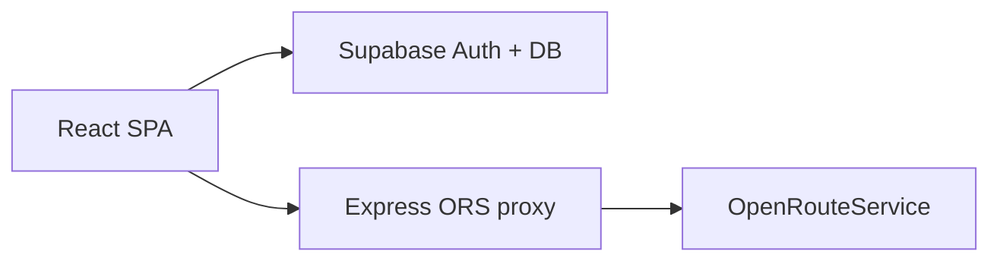

# Cycle Your Way

Aplikacja webowa do planowania tras rowerowych: A→B i pętle, porównanie wariantów, profil wysokościowy, nawierzchnia, nawigacja GPS, eksport GPX oraz zapis / udostępnianie tras.

**Live demo:** https://cycle-your-way-pi.vercel.app  
**API:** _(wstaw URL backendu Render/Railway po deployu)_

## Funkcje

- **Trasa A → B** — do trzech wariantów z porównaniem (dystans, czas, drogi główne, wznios)
- **Pętla treningowa** — dystans 5–100 km
- **Unikanie dróg głównych** — ranking wariantów / pętli
- **Profil wysokościowy i nawierzchnia**
- **Tryb jazdy** — GPS, turn-by-turn, QR na telefon
- **Konta** — Supabase Auth (logowanie, rejestracja, reset hasła)
- **Zapisane trasy** — wczytywanie, rename, usuwanie, publiczny share link
- **Profil** — preferencje (unikanie dróg głównych, domyślny dystans pętli)
- **Eksport** — GPX + przybliżony Google Maps

## Architektura



| Warstwa | Technologia | Rola |
|---------|-------------|------|
| Frontend | React, Vite, Tailwind, Leaflet, Recharts | UI, mapa, nawigacja |
| Auth i trasy | Supabase Auth + PostgreSQL + RLS | konta, `saved_routes`, profile |
| API | Node.js, Express | proxy ORS (geocode, route, loop) |

Klucz `ORS_API_KEY` zostaje wyłącznie na backendzie.

## Struktura

```
CycleYourWay/
├── .github/workflows/ci.yml
├── README.md
└── cycle-route-mvp/
    ├── frontend/          # React (Vercel)
    ├── backend/           # Express (Render / Railway)
    ├── supabase/          # schema.sql + profiles.optional.sql
    └── docs/              # deploy
```

## Wymagania

- Node.js 20+
- [OpenRouteService](https://openrouteservice.org/dev/#/signup) API key
- Projekt [Supabase](https://supabase.com)

## Uruchomienie lokalne

### 1. Backend

```bash
cd cycle-route-mvp/backend
cp .env.example .env
# ORS_API_KEY=...

npm install
npm run dev
```

API: `http://localhost:5000`

### 2. Supabase

1. Nowy projekt → **SQL Editor** → uruchom `cycle-route-mvp/supabase/schema.sql`
2. (Opcjonalnie, pod profil) `profiles.optional.sql`
3. Authentication → Email włączony
4. **Connect** / API Keys → Project URL + publishable/anon key

### 3. Frontend

```bash
cd cycle-route-mvp/frontend
cp .env.example .env.local
```

```env
VITE_SUPABASE_URL=https://twoj-projekt.supabase.co
VITE_SUPABASE_ANON_KEY=sb_publishable_...
VITE_API_URL=http://localhost:5000
```

```bash
npm install
npm run dev
```

Aplikacja: `http://localhost:5173`

Na Windows, jeśli PowerShell blokuje `npm`, użyj `npm.cmd`.

## Deploy (checklist CV)

Szczegóły: [`docs/DEPLOY_BACKEND.md`](cycle-route-mvp/docs/DEPLOY_BACKEND.md), [`docs/SUPABASE_VERCEL.md`](cycle-route-mvp/docs/SUPABASE_VERCEL.md)

1. **Backend (Render):** root `cycle-route-mvp/backend`, env `ORS_API_KEY`, `ALLOWED_ORIGINS`
2. **Frontend (Vercel):** root `cycle-route-mvp/frontend`, env `VITE_SUPABASE_URL`, `VITE_SUPABASE_ANON_KEY`, `VITE_API_URL`
3. Wklej live URL powyżej w tym README

`frontend/vercel.json` i `backend/render.yaml` są przygotowane pod szybki deploy.

## Testy i CI

```bash
cd cycle-route-mvp/frontend && npm test && npm run lint
cd cycle-route-mvp/backend && npm test
```

GitHub Actions: `.github/workflows/ci.yml` (lint, test, build).

## Endpointy API

| Metoda | Ścieżka | Opis |
|--------|---------|------|
| GET | `/api/health` | Status + `orsConfigured` |
| GET | `/api/geocode?address=` | Geokodowanie (PL) |
| POST | `/api/route` | Trasa A→B |
| POST | `/api/loop` | Pętla |

## Licencja

Projekt portfolio / edukacyjny. OpenStreetMap, OpenRouteService i inne usługi zewnętrzne mają własne warunki.
