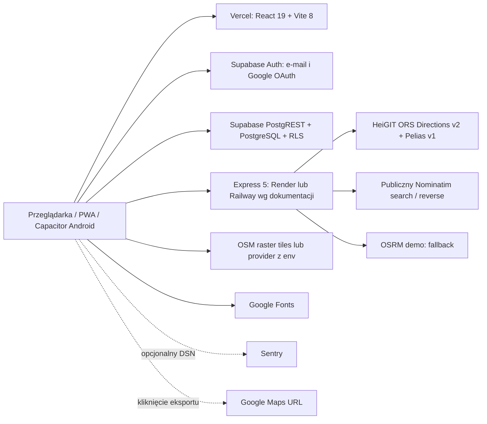
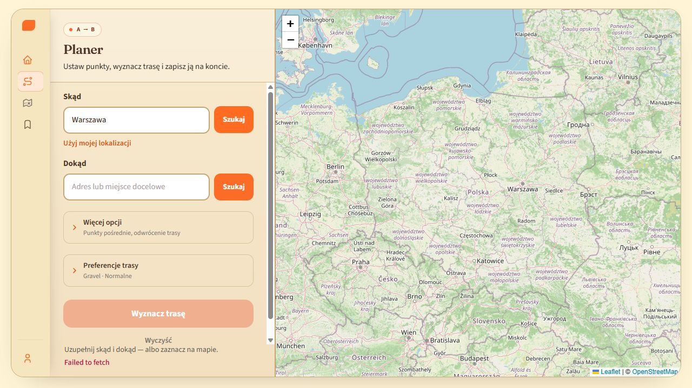

# Cycle Your Way — Production Readiness Audit

> Raport opisuje stan sprzed napraw. Postęp implementacji i pozostałe blokady: [IMPLEMENTATION_PROGRESS.md](docs/IMPLEMENTATION_PROGRESS.md). Nie traktuj historycznych wyników tego audytu jako ponownej oceny zmienionego kodu.

Data: **27.09.2026**. Badany commit: **7da22a3**, lokalny checkout bez zmian na początku audytu. Repozytorium Git zaczyna się katalog wyżej niż aplikacja: `D:/CycleYourWay/CycleYourWay`; aplikacja jest w `cycle-route-mvp`.

## 1. Executive Summary

**Decyzja: NO-GO dla nieograniczonej publicznej bety i wdrożenia komercyjnego.** Projekt jest działającym, rozwiniętym MVP. Nie wymaga przepisania ani migracji na nowy framework. Wymaga przede wszystkim domknięcia ochrony danych, kontroli użycia usług mapowych, trwałego zapisu jazdy i procesu wydawania.

Najważniejsza korekta założeń: **obecna aplikacja nie używa MongoDB ani Mongoose.** Uwierzytelnianie i baza to **Supabase Auth + PostgreSQL/PostgREST**, wywoływane bezpośrednio z frontendu. Express pośredniczy w routingu/geokodowaniu. Są już RLS, kasowanie konta, eksport konta, strony prawne, PWA i Android/Capacitor, ale nie wszystkie realizują deklarowane zachowanie.

Najpilniejsze ustalenia:

1. **HIGH / P0:** autocomplete korzysta z publicznego Nominatim, sprzecznie z jego polityką. Limiter około 1/s nie legalizuje autocomplete.
2. **HIGH / P0:** publiczne proxy bez uwierzytelnienia i budżetu dostawcy pozwala wyczerpać wspólną pulę API; pętle mnożą liczbę wywołań. `60/min/IP` nie odpowiada `40/min` całego klucza ORS.
3. **HIGH / P0:** udostępnianie opisane jako dostęp przez link jest w SQL publicznym odczytem wszystkich takich rekordów, z możliwością zbiorczego odczytu geometrii i `user_id`.
4. **HIGH / P0:** awaryjny routing OSRM gubi punkty pośrednie, nie zapewnia kontraktu routingu rowerowego i nie ma instrukcji manewrów.
5. **HIGH / P0:** historia jazdy nie ma trwałego draftu ani kolejki zapisu; błąd schematu może być zakwalifikowany jako `ride_saved`.
6. **HIGH / P0, ryzyko warunków usługi:** aktualne ToS HeiGIT zabraniają przesyłania danych osobowych; wysyłanie aktualnej pozycji / adresów domowych wymaga wyjaśnienia z dostawcą i analizy prawnej. Nie wystarczy usunięcie e-maila z requestu.
7. **HIGH / P1:** eksport konta jest niepełny: osiem tras i osiem jazd, bez ich pełnych geometrii. Polityka prywatności nie zawiera podstawowego kompletu informacji i pomija część odbiorców danych.
8. **P1:** niepotwierdzone operacyjnie RLS, backup/restore, SMTP, regiony, środowiska i konfiguracja produkcji. Nie wolno utożsamiać obecności SQL/checklisty z wdrożeniem zabezpieczenia.

Nie potwierdzono podatności klasy **CRITICAL** typu przejęcie wszystkich prywatnych danych, RCE czy wyciek klucza administracyjnego. P0 oznacza blokadę wydania, a nie automatycznie CRITICAL security.

### Dowody i granice audytu

| Kontrola | Wynik |
|---|---|
| Frontend `npm test` | **18/18**, 3 pliki |
| Backend `npm test` | **21/21**, 5 plików |
| `npm run typecheck` / `npm run lint` | Przeszły bez diagnostyk; `checkJs:false` ogranicza kontrolę dużych plików JSX |
| Frontend production build | Sukces; Vite ostrzega o dużym głównym chunku |
| Aktualny `npm audit --prefer-online` | Frontend: **14** pozycji: 7 high, 6 moderate, 1 low; backend: **6**: 4 high, 1 moderate, 1 low; 0 critical |
| Lokalny probe rzeczywistego Express, z atrapami Axios | Potwierdzone anonymous routing, wildcard Vercel CORS, HTML przy błędach, utrata waypointów fallbacku, 429 i wyjątek health |
| Przeglądarka | Landing, onboarding, planer, mapa/attribution, modal logowania, `/privacy`, niedostępne API → `Failed to fetch` |
| Historia Git | 54 osiągalne commity; ograniczony skan wzorców sekretów, historii env oraz bieżącego klucza ORS w historycznym `server.js`: bez trafień |
| Panele Supabase / Vercel / Render / HeiGIT | **Niezweryfikowane**: brak odczytu ustawień konta/infrastruktury |
| Produkcyjna domena | Narzędzie web nie uzyskało dostępu do domeny i stron prawnych; to **nie dowód awarii**. DNS/TLS/realne nagłówki pozostają niepotwierdzone |
| Realny GPS / Safari / Chrome Android / Android APK | **Nieprzetestowane na urządzeniu**. Próba viewportu 390×844 nie dała wiarygodnego mobilnego obrazu; screenshot pozostał desktopowy |
| Pełne E2E z kontem i bazą | **Nie wykonano**. Lokalny UI miał atrapy adresów backendu/Supabase, bez logowania i zapisów produkcyjnych |

Pierwsze uruchomienia testów/builda blokował sandbox (`spawn EPERM`); ponowienie z uprawnieniami zakończyło się sukcesem. Pierwszy audyt npm w trybie cache pokazywał zero — **nie jest miarodajny**. Wnioski opierają się na późniejszym odczycie online. Nie wykonano `npm audit fix`, aktualizacji, deployu ani operacji na produkcyjnej bazie.

Materiały: [inwentarz wszystkich bezpośrednich paczek](docs/audit/DEPENDENCIES.md), [frontend audit](docs/audit/frontend-npm-audit.json), [backend audit](docs/audit/backend-npm-audit.json), pliki `*-outdated.json`, [lokalny probe](docs/audit/backend-probe.cjs). Numery linii poniżej dotyczą badanego commita.

## 2. Current Architecture

### Komponenty i przepływy

- `frontend/src/App.jsx` (~2000 linii): stan widoków, planer, pobieranie routingu, zapis tras, inicjowanie jazdy, share/deep links. Stan lokalny React + Auth Context; brak potrzeby dodawania Redux wyłącznie z powodu skali projektu.
- `Root.tsx`: ręczne rozpoznanie `/privacy`, `/terms` i aliasów PL; pozostałe widoki przełączane stanem, bez routera. Query `?share=` i `?ride=` identyfikuje trasę. Back/forward i głębokie linki wymagają testów.
- `PlannerMap.jsx`: Leaflet/react-leaflet, markery start/cel/via, porównanie wariantów, blokada gestów na małym ekranie. `ElevationChart.jsx` i `routeStats.js`: profil wysokości, nawierzchnie i stromizny.
- `RideView.jsx`: GPS, manewry/TTS, rerouting, pauza, podsumowanie; pełny ślad w `useRef`. `location.ts`, `keepAwake.ts`, `backgroundLocation.js` abstrahują web/Capacitor.
- `SavedRoutes.jsx`: lista, odczyt, nazwa, tagi, ulubione, publiczność, usuwanie. Edycja geometrii przez planer; granice edycji zapisanej trasy trzeba wyjaśnić użytkownikowi.
- `AuthContext.tsx`: Supabase session, e-mail/hasło, potwierdzenie e-mail, reset, Google OAuth. Express nie obsługuje haseł ani sesji użytkowników.
- `ProfileModal.jsx`: profil, preferencje, osiem ostatnich tras/jazd, statystyki, eksport JSON i RPC kasowania konta.
- Backend: `server.js` (~850 linii), moduły routingu/rankingu/pętli/geokodowania/cache. Brak połączenia backend → baza.
- `supabase/schema.sql`: deklaracja tabel i polityk, bez uporządkowanego łańcucha migracji i automatycznej weryfikacji wdrożenia.
- `frontend/public/sw.js`: shell PWA, cache zasobów same-origin; nie cache'uje cross-origin, API ani Supabase. Brak offline map i kolejki zapisu.
- `frontend/android`: projekt Capacitor/Gradle, foreground GPS, manifest uprawnień i App Links; brak iOS i działającego background GPS w v1.

### Dane

| Zasób | Co zawiera | Ochrona w dostarczonym SQL |
|---|---|---|
| `auth.users` | Konto/e-mail; hasła i tożsamości zarządza Supabase | Zarządzana usługa Auth, ustawienia live nieznane |
| `profiles` | Nazwa, home_area, styl jazdy, kondycja, dystanse, czas, nawierzchnie, preferencje | RLS read/insert/update tylko `auth.uid()=id` |
| `saved_routes` | Właściciel UUID, nazwa, tryb, pełny GeoJSON, dystans/czas, publiczność, ulubione, tagi, czas utworzenia | RLS własne rekordy + publiczny SELECT `is_public=true` |
| `rides` | Właściciel, route_id, nazwa, dystans/czas/prędkości, zdarzenia off-route, track_geojson, znaczniki czasu | RLS własne rekordy; brak sprawdzenia własności referencji `route_id` |
| localStorage | Sesja Supabase, osiem adresów z koordynatami, dystans pętli, onboarding | Wspólne dla originu, brak per-user namespace historii adresów |
| Pamięć backendu | Cache geokodowania 10 min/120 wpisów, routing 5 min/80 wpisów, kolejka Nominatim | Nietrwałe, per proces |

Eksport GPX 1.1 jest własnym generatorem XML w `exportToGpx.js`. **Nie znaleziono importu GPX ani importu/eksportu KML.** Nie ma upload endpointu ani biblioteki parsera plików użytkownika. `status='imported'` w SQL nie dowodzi istnienia importu. Google Maps to URL, nie płatne API Directions. Wysokość pobierana przez `elevation:true` w ORS Directions, bez osobnego wywołania Elevation API.

## 3. Critical Issues — blokady uruchomienia

### B01 — Nominatim autocomplete: HIGH, P0, potwierdzone w kodzie i polityce

`AddressAutocomplete.jsx:31–36` wysyła po 320 ms żądanie z `autocomplete=true`, od dwóch znaków. `backend/lib/geocode.js:340+` zawsze rozpoczyna od Nominatim; ORS/Pelias jest dopiero fallbackiem. Proxy nie zmienia charakteru autocomplete. [Polityka Nominatim](https://operations.osmfoundation.org/policies/nominatim/) zabrania autocomplete i ogranicza sumę ruchu aplikacji do 1/s. Rozwiązanie: podpowiedzi kierować wyłącznie do usługi, która je dopuszcza; Nominatim ewentualnie tylko do świadomego wyszukania zatwierdzonego adresu, z limitem globalnym, cache i możliwością przełączenia dostawcy. Dla pozycji osobistych uwzględnić także B06.

### B02 — wyczerpanie wspólnych limitów: HIGH, P0, potwierdzone

`backend/server.js:113–123`: 60 żądań/min/IP, pamięć procesu; brak auth, limitów per konto, budżetu dziennego, globalnej współbieżności, limitu zadań w kolejce. Dopuszczony brak Origin i każde `*.vercel.app`. CORS nie zatrzyma bota używającego HTTP. Jeden użytkownik może zużyć całą pulę ORS; wiele IP skaluje atak. Brak kontroli bezpośrednich zapisów do Supabase pozwala osobno zapełniać bazę własnymi rekordami.

`App.jsx:321–366` zwykle wykonuje dwa requesty dla A→B: single, potem alternatives. `server.js:730+` dla pętli uruchamia równoległe kandydaty i korekty długości; retry profilu zwiększa liczbę wywołań. Anulowanie fetch na frontendzie nie anuluje pracy Axios na backendzie. Log `candidatesHint` jest estymatą kandydatów, nie licznikiem rzeczywistych requestów.

Rozwiązanie: osobne tanie/kosztowne limity, weryfikacja JWT Supabase na kosztownych endpointach lub mała pula gościnna, limit globalny odpowiadający kluczowi, dzienny budżet, maks. liczba wywołań na operację, bounded queue i 429 z Retry-After. Na jednej instancji wystarczy prosty limiter; współdzielony magazyn dopiero przy wielu instancjach. Kwoty bazowe egzekwować w bazie/RPC, bo klient omija Express.

### B03 — link prywatności nie jest linkiem niepublicznym: HIGH, P0

`supabase/schema.sql:46–50`: `using (is_public = true)` zezwala na SELECT publicznych wierszy bez znajomości ich UUID, jeśli standardowe role API mają grant SELECT. UI filtruje po ID, ale klient nie musi używać UI. Może odczytać publiczne trasy wraz z `user_id`, tagami i innymi dostępnymi kolumnami. `LegalPage.tsx` przedstawia model jako udostępnienie posiadaczom linku. To nie jest dowód odczytu tras `is_public=false` — te są prawidłowo ograniczone w SQL.

Wybrać jawnie jeden model: publiczny katalog z wyraźnym ostrzeżeniem i minimizacją danych albo udostępnienie przez losowy, odwoływalny token w kontrolowanym RPC/endpointcie. Przy tym drugim usunąć ogólny publiczny SELECT tabeli. Test anonimowy ma potwierdzić, że listowanie nie działa, a konkretny ważny token działa. Nie testowano cudzych danych produkcyjnych.

### B04 — niebezpiecznie niezgodny fallback: HIGH, P0

`server.js:191–215,503–510` wysyła do demo OSRM jedynie początek i koniec. Lokalny probe dla trzech waypointów potwierdził URL z dwoma. `/bicycle/` nie dowodzi, że serwer jest przygotowany profilem rowerowym: profil OSRM wynika z preprocessingu danych. Zwracany Feature nie ma ORS segments/instructions, powierzchni ani elevation. `ensureNavigableFeature` może ponowić routing i nadal nie uzyskać manewrów.

Bezpieczne zachowanie: zachować ostatnią poprawną trasę i wyświetlić niedostępność, zamiast cichej zmiany jej znaczenia; ewentualny drugi provider musi spełniać kontrakt cycling + wszystkie via + instrukcje. [OSRM API](https://project-osrm.org/docs/v26.4.0/http), [polityka demo](https://github.com/Project-OSRM/osrm-backend/wiki/Api-usage-policy). Nie zakładam, że obecny demo endpoint na pewno działa ani że na pewno odrzuca `bicycle` — tego nie testowano live.

### B05 — utrata aktywności i pozorny sukces: HIGH, P0

`RideView.jsx:178,327–330`: ślad tylko w RAM. `493–494`: wywołanie async zapisu bez await i natychmiastowy `onExit`. `App.jsx:1210–1217`: błąd zakwalifikowany jako brak kolumny trafia do gałęzi sukcesu. Inny wyjątek tylko logowany przez captureException, bez trwałego draftu. Gość nie zapisuje jazdy w bazie, a UI nie stanowi trwałego archiwum. Refresh, zamknięcie aplikacji lub problem sieciowy może utracić cały przejazd.

Wprowadzić lokalny draft w IndexedDB z krótkim interwałem checkpointów, identyfikator aktywności dla idempotentnego zapisu, kolejkę retry oraz status „oczekuje/zapisano/błąd”. Zapis ma potwierdzić faktyczny sukces; usunąć draft dopiero po potwierdzeniu. Pokazać możliwość eksportu awaryjnego. To ważniejsze niż kolejne animacje.

### B06 — warunki dostawcy a osobista lokalizacja: HIGH, P0, wymaga rozstrzygnięcia

Aktualne [HeiGIT ToS](https://account.heigit.org/info/tos), odczytane w przeglądarce, zabraniają przesyłania danych osobowych poza danymi zarządzania kontem. `offRouteRecalc.js:12–45` przesyła aktualną pozycję, a geocoder adresy wpisane przez użytkownika. Współrzędne nie zawsze są danymi osobowymi, ale pozycja jazdy, adres domowy i powtarzalne punkty mogą nimi być. Backend ukrywa IP użytkownika przed ORS, lecz nie zapewnia automatycznie anonimizacji geometrii.

Przed betą: udokumentować przepływ, wyjaśnić dozwolone użycie z HeiGIT i prawnikiem; gdy nie ma podstaw, wybrać dostawcę/hosting dopuszczający takie przetwarzanie. Zgoda w przeglądarce nie uchyla ToS. Wyniki ORS mają CC BY-SA 4.0 i wymagają oznaczenia HeiGIT/OSM; uwzględnić zapis oraz eksport wyników. Nie oznacza to obowiązku upublicznienia prywatnego śladu GPS użytkownika.

## 4. Security Issues

### Klasyfikacja

| ID / severity | Dowód / scenariusz | Zalecenie |
|---|---|---|
| CRITICAL | Brak potwierdzonego znaleziska tej klasy | Nie traktować tego jako certyfikatu bezpieczeństwa |
| S01 HIGH | B02: publiczne kosztowne proxy, mnożenie wywołań | Budżety, auth/gość, globalny limiter, test przy wielu IP |
| S02 HIGH | B03: publiczny SELECT wszystkich tras publicznych i metadanych właściciela | Zmienić model udostępniania lub uczciwie oznaczyć katalog |
| S03 HIGH | `schema.sql:9,223`: nieograniczone przez schemat rozmiary JSON, liczba rekordów, tekst/tagi; brak walidacji kształtu GeoJSON | Limity na rekord, konto i tempo zapisu; DB constraints/RPC; zachować RLS |
| S04 MEDIUM | `server.js:61`: każde `*.vercel.app`; allowlista env tylko dodaje, nie usuwa defaultów | Konkretne originy per środowisko. Nie traktować CORS jak auth |
| S05 MEDIUM | Brak `trust proxy`; limiter widzi peer proxy, niekoniecznie użytkownika | Ustawić zaufanie do faktycznej topologii Render/Railway i przetestować spoofing; nie ustawiać bezrefleksyjnie `true` |
| S06 MEDIUM | `rides.route_id` FK dowodzi istnienia trasy, nie własności/publiczności; INSERT policy kontroluje wyłącznie `user_id` jazdy | Constraint trigger/RPC sprawdzający prawo do wskazanej trasy. Nie wykazano odczytu jej geometrii tą drogą |
| S07 MEDIUM | Brak globalnego ErrorBoundary, CSP i ogólnych nagłówków bezpieczeństwa w `vercel.json`; sesja Supabase persistuje w localStorage | ErrorBoundary, CSP Report-Only → egzekwowanie, frame-ancestors, nosniff, polityka referrera kompatybilna z mapami; przegląd XSS |
| S08 MEDIUM | `exportToGpx.js:25–30`: lat/lon wstawiane do XML bez sprawdzenia typu; publiczny GeoJSON może mieć string | Walidacja finite/range i GeoJSON przed renderem/eksportem. To wektor XML injection w eksporcie, nie potwierdzone wykonanie JS w aplikacji |
| S09 MEDIUM | Nieprawidłowy JSON/CORS → standardowy HTML Express; brak error middleware | Jednolity JSON, bez stacków; `NODE_ENV=production`; request ID, redakcja logów |
| S10 MEDIUM | Brak wspólnego deadline/ograniczonej kolejki Nominatim; fetch UI często bez timeoutu | Termin dla całego requestu, AbortController na backendzie, odrzucanie nadmiaru pracy |
| S11 MEDIUM | Historie adresów z koordynatami pozostają na współdzielonym urządzeniu; kasowanie konta ich nie usuwa | Namespace konta, opcja czyszczenia, rozsądna retencja; czyszczenie po usunięciu konta |
| S12 LOW | `/api/reverse?lat=999&lng=21` → 500 zamiast 400, parametry bool przez `Boolean('false')` → true, enum lookup dopuszcza odziedziczone własności obiektu | Schemat walidacji, own-property/Set, ścisłe typy, maks. długość adresu |
| S13 LOW | `.gitignore` nie obejmuje wszystkich `.env.production`, `.env.staging` | Ignorować `.env*` z wyjątkiem jawnych przykładów; skan sekretów w CI |

### Co jest już poprawne

- Klucz ORS jest czytany po stronie serwera i wysyłany w nagłówku Authorization. W przykładach env nie ma realnego klucza. Klucz Supabase anon/publishable w bundle jest zamierzony; bezpieczeństwo zapewniają RLS i granty, nie jego ukrywanie.
- SQL definiuje RLS dla wszystkich trzech tabel; INSERT/UPDATE kontrolują `auth.uid()`, UPDATE ma WITH CHECK. UI dodatkowo filtruje właściciela, a zapis weryfikuje użytkownika przez `getUser()`.
- `delete_own_account` pobiera UID z `auth.uid()`, nie parametru klienta, odrzuca anonima, ma ustalony search_path, odbiera PUBLIC EXECUTE i przyznaje authenticated. FK `on delete cascade` usuwa własne trasy/profil/jazdy.
- Express ma `32kb` limit JSON, walidację finite i zakresu punktów, limit 50 waypointów, pętle 5–200 km, timeouts upstream.
- React renderuje nazwy jako tekst; nie znaleziono `dangerouslySetInnerHTML`, eval ani bindPopup z tekstem użytkownika. HTML w ikonach Leaflet jest lokalnym szablonem; attribution z env jest zaufaną konfiguracją.
- URL-e upstream są stałe lub ustawiane przez operatora, nie pochodzą wprost z użytkownika. Nie potwierdzono SSRF. Nie ma MongoDB/NoSQL injection; zapytania Supabase są budowane SDK, bez konkatenowanego SQL.
- Auth używa bearer session; nie znaleziono własnych endpointów sesyjnych opartych o cookies. Klasyczny CSRF dla tych zapisów ma mniejszą ekspozycję niż przy automatycznym cookie, ale redirecty OAuth/reset i XSS wymagają testów. Nie ma uzasadnienia dodawania własnego systemu JWT.

### Auth, ataki na konta i sekrety

Rate limiting Express **nie obejmuje Supabase Auth/PostgREST**. Sprawdzić w panelu: confirm e-mail, limity rejestracji/logowania/resetów, ochronę przed automatycznymi rejestracjami, politykę haseł, MFA administratora i redirect allowlist. CAPTCHA dopiero tam, gdzie potrzebna, nie jako zastępstwo limitów. `polishAuthError` może ujawniać „konto istnieje”; rzeczywista enumeracja zależy od ustawień i odpowiedzi Auth. Reset w UI ma prawidłowo neutralny komunikat.

`AuthContext.tsx:87+` traktuje poprawną rejestrację bez sesji jako wyjątek i sugeruje użytkownikowi wyłączenie Confirm email. To należy usunąć z produktu; pokazać stan oczekiwania na potwierdzenie. Brak custom SMTP w repo nie oznacza braku w panelu, ale default Supabase nie jest rozwiązaniem do publicznej rejestracji: [dokumentacja SMTP](https://supabase.com/docs/guides/auth/auth-smtp) ogranicza go do testów i adresów członków zespołu.

Skan historii: sprawdzono nazwy historycznych env/credentials/db, wzorce Google/GitHub/JWT/private-key/Mongo URI w 54 osiągalnych commitach i dokładne wystąpienie bieżącego ORS key w historycznych `server.js`. Wynik ujemny. Nie skanowano sekretów w panelach, logach CI, niedostępnych refach, reflogach, zrzutach ekranu, artefaktach hostingu ani skasowanych obiektach Git. Skan wzorców nie wykrywa każdego arbitralnego hasła/API key. Nie ma podstaw do twierdzenia, że „sekrety na pewno nigdy nie wyciekły”. Włączyć secret scanning; rotacja obowiązkowa po potwierdzonym wycieku, bez masowej rotacji na podstawie samego podejrzenia.

## 5. Legal / Privacy / GDPR

To techniczna analiza ryzyk i lista do konsultacji z prawnikiem, **nie formalna porada prawna**. Publiczna bezpłatna beta też przetwarza dane osobowe.

### Rzeczywista mapa danych i odbiorców

| Dane | Miejsce / odbiorca | Stan / luka |
|---|---|---|
| E-mail, hasło, sesja, ewentualny Google OAuth | Supabase Auth; Google przy wybraniu OAuth | Nie własna baza haseł. Dane techniczne Auth i faktyczne scope/retencja wymagają panelu |
| Profil, home_area, preferencje, zapisane trasy | PostgreSQL Supabase | Część preferencji nie wpływa na routing; minimalizować zbieranie |
| GPS w trakcie jazdy | Pamięć przeglądarki; po końcu track_geojson w Supabase dla zalogowanego | Brak osobnego przełącznika zapisu śladu; dokument prawny mówi o nim warunkowo, choć kod zapisuje go automatycznie |
| Adresy i wybrane miejsca | Backend → Nominatim / Pelias; lokalnie osiem wpisów | Brak retencji użytkowej i opisu wszystkich odbiorców |
| Start/cel/via, pozycja reroutingu | Backend → ORS; fallback OSRM | Nie przesyła e-maila; współrzędne nadal mogą identyfikować osobę |
| Widoczny obszar mapy, IP, techniczne nagłówki | Tile provider bezpośrednio | Samo otwarcie mapy powoduje zewnętrzne żądania |
| IP i żądania fontów | Google Fonts z `index.html:15–20` | Samo wejście na stronę; zalecany self-host fontów |
| Błędy, URL-e, kontekst techniczny | Sentry, gdy jest DSN; backend console/hosting | `sendDefaultPii:false` pomaga, lecz brak własnego scrubbera adresów/GPS/tokenów |
| Wydarzenia produktowe | CustomEvent; `gtag` tylko jeśli istnieje | Nie znaleziono instalacji GA/GTM. Nie wolno twierdzić, że GA aktualnie śledzi użytkowników |
| Punkty wyeksportowane do Google Maps | Google dopiero po świadomym otwarciu linku | Dodać jasną informację o zmianie dostawcy i przybliżeniu trasy |

### Konkretna checklista prawna

- Ustalić administratora danych i kontakt, cele i podstawy prawne dla konta, zapisu jazdy, publicznego share, bezpieczeństwa oraz ewentualnej analityki. Podstawy oceniać dla konkretnego celu; nie zbierać zgody „na wszystko”.
- Rozbudować istniejące `/privacy` i `/terms`: odbiorcy, retencja/kryteria, prawa i sposób realizacji, skarga do UODO, dobrowolność/konsekwencje, transfery poza EOG i ich mechanizmy. [UODO o prawach i obowiązku informacyjnym](https://uodo.gov.pl/pl/493/2254).
- Określić czas przechowywania kont, tras, jazd, lokalnej historii, logów i kopii. Obecnie brak automatycznej retencji. Przykładowa decyzja produktowa: użytkownik kontroluje zapisane trasy, lokalna historia maks. 30 dni, krótkie logi bez GPS; okresy wymagają uzasadnienia, nie są ustawowym standardem. [UODO o retencji](https://uodo.gov.pl/pl/676/4260).
- Udostępnić kompletny eksport: stronicowanie wszystkich rekordów, geometrie, ślady, profil i odpowiednie dane konta. Obecny eksport nie realizuje tej obietnicy. Procedura ręczna może obsłużyć rzadkie żądania dodatkowych danych Auth/logów, z weryfikacją tożsamości.
- Kasowanie konta już istnieje. Przetestować na staging kaskady, sesje po skasowaniu i lokalne cache. Zapewnić usuwanie pojedynczej jazdy albo prostą procedurę żądania; UI nie oferuje obecnie pełnego zarządzania historią. Backupy wymagają procedury ponownego zastosowania usunięć po restore.
- Przejrzeć DPA i subprocessors Supabase, hostingu, SMTP, Sentry oraz wybranego dostawcy lokalizacji. Nie każdy odbiorca automatycznie jest procesorem — ustalić role. Region UE nie wyklucza transferów support/telemetrii. [Supabase DPA](https://supabase.com/legal/customer-resources/data-processing-addendum) jest dostępne; jego istnienie nie potwierdza konfiguracji konkretnego konta.
- Ocenić ryzyko śladów GPS: adres domu/pracy, rutyny, miejsca wrażliwe. Lokalizacja sama w sobie nie zawsze jest szczególną kategorią art. 9, lecz może ujawniać takie informacje. Udokumentować ocenę potrzeby DPIA; nie zakładać automatycznie obowiązku IOD lub DPIA dla małej bety.
- Mieć krótki rejestr czynności/przepływów i procedurę naruszenia: detekcja, ograniczenie dostępu, ocena ryzyka, dokumentacja, ocena zgłoszenia w terminie 72 h oraz powiadomienia osób, gdy wymagane. Rozmiar działalności nie wyłącza automatycznie odpowiedzialności.
- Regulamin: identyfikacja usługodawcy, zasady konta, reklamacji/usuwania, wymogi techniczne, mapy/nawigacja, udostępnianie. Obecne absolutne wyłączenie odpowiedzialności wymaga korekty prawnika.
- Przed sprzedażą: cena, płatności/subskrypcje, rezygnacja, reklamacje/zgodność usługi cyfrowej, prawa konsumenta i ewentualne odstąpienie, podatki/faktury. Sprawdzić zastosowanie wymogów dostępności do planowanej usługi i ewentualnych wyłączeń mikroprzedsiębiorcy. Nie wdrażać checkoutu przed tym rozstrzygnięciem.
- Publiczny katalog/treści użytkowników może wymagać procedury zgłoszenia nadużycia/usunięcia i analizy właściwych obowiązków platformowych; nie zakładać pełnego reżimu dużej platformy dla obecnego MVP.

### Checkboxy, cookies i zgody — decyzje proporcjonalne

| Element | Decyzja |
|---|---|
| Akceptacja regulaminu | Zalecane udokumentowane zawarcie umowy: checkbox/link przy rejestracji, wersja i timestamp; objąć także OAuth |
| „Zgoda na politykę prywatności” | Nie traktować obowiązku informacyjnego jako zgody. Link i potwierdzenie zapoznania się można zastosować, ale nie zastępuje to podstawy prawnej |
| Zgoda marketingowa | Tylko jeśli marketing zostanie dodany, osobna i opcjonalna; brak obecnego marketingu w kodzie |
| Cookie banner | Nie jest automatycznie wymagany tylko dlatego, że istnieje sesja. Najpierw klasyfikacja storage. Niezbędne mechanizmy mają wyjątek; analityka/reklama i niekonieczne odczyty wymagają oceny/zgody przed uruchomieniem |
| localStorage historii adresów | To także przechowywanie w urządzeniu; nie omija przepisów o cookies. Rozważyć świadome włączenie historii, możliwość wyczyszczenia i wyłączenia |
| GPS permission | Uprawnienie techniczne przeglądarki, nie uniwersalna zgoda na przechowywanie, marketing czy przekazanie dostawcom |
| `/cookies` | Osobny URL nie jest konieczny, jeśli czytelna kompletna informacja jest w `/privacy`; dodać, jeśli upraszcza komunikację |
| Sentry / analytics | Rozdzielić diagnostykę od analityki. Minimalny crash reporting bez GPS/replay; legal basis i dostęp do urządzenia ocenić. Nie wysyłać eventów do przyszłego `gtag` przed właściwą decyzją/zgodą |

Podstawa oceny urządzenia: [Prawo komunikacji elektronicznej, art. 398–400](https://isap.sejm.gov.pl/isap.nsf/download.xsp/WDU20240001221/O/D20241221.pdf). Przeczytano art. 399 z wyjątkiem usług niezbędnych; dokument jest tekstem ogłoszonym, aktualne brzmienie i zastosowanie powinien potwierdzić prawnik. Pełny tekst EUR-Lex nie był dostępny w narzędziu web; wykorzystano aktualne materiały UODO zamiast udawać odczyt całego RODO.

## 6. External APIs

Stan dokumentacji zweryfikowany 27.09.2026; rzeczywisty plan/zużycie konta operatora nie są znane.

| Service | Current usage | Risk | Pricing/limits | Action required |
|---|---|---|---|---|
| HeiGIT ORS Directions v2 | POST `api.heigit.org/openrouteservice/v2/directions/{cycling-profile}/geojson`, Authorization backend; A→B, alternatywy, pętle, rerouting, elevation | Wspólna pula, fan-out, warunki danych osobowych, brak attribution | Standard 0 EUR: **2000/dzień, 40/min** | B02/B06, licznik realnych wywołań, limiter globalny, warunki zapisu/eksportu |
| HeiGIT Pelias v1 | `/pelias/v1/search`, `/autocomplete`, Authorization; fallback dla Nominatim | Może dostać osobiste adresy, brak własnego cache ORS geocode | Geocoding Standard **3000/dzień, 100/min** | Osobny budżet, jawny provider autocomplete, walidacja adresów |
| Nominatim OSMF | `/search` format=json, `/reverse` format=jsonv2, bez key; UA; countrycodes=pl dla search | B01, globalna kolejka, adresy osobiste | Darmowy publiczny endpoint, **1 request/s całej aplikacji**, brak SLA | Usunąć autocomplete; dobór usługi dopuszczającej ruch i dane |
| OSM raster tiles | `https://{s}.tile.openstreetmap.org/{z}/{x}/{y}.png`; klient, bez key | Best-effort, blokada obciążenia, obecny URL niezgodny z zalecanym dokładnym hostem | Brak opłat i gwarantowanej kwoty dla aplikacji | Aktualny URL, attribution, caching; ocena ruchu i provider produkcyjny |
| OSRM demo | `/route/v1/bicycle/{start};{end}`, bez key, timeout 15 s | B04, brak SLA, ograniczenia demo | Brak umowy na produkcyjną przepustowość | Nie używać jako cichego fallbacku nawigacji |
| Supabase Auth/PostgREST | `auth/v1`, `rest/v1` tabele/RPC, anon key + JWT użytkownika | RLS/granty live, nadużycia zapisów, SMTP, egress geometrii | Free 50k MAU, 500 MB DB, 5 GB egress; Pro od $25/mies., 8 GB DB, 250 GB egress | Potwierdzić plan, region, backup, limity/Auth i staging |
| Google OAuth | `signInWithOAuth('google')`; client secret w panelu Supabase, nie repo | WebView/deep-link callback, scope i privacy | Nie ma w kodzie płatnego Maps SDK; limity OAuth zależą od konfiguracji | Zweryfikować consent screen, redirecty i flow natywne |
| Google Maps URLs | `google.com/maps/dir/?api=1&travelmode=bicycling` | Trasa jest przybliżona; limit waypointów zależy od platformy | URL-e nie wymagają API key | Nie sprzedawać jako dokładny eksport nawigacji; test mobile |
| Google Fonts | CSS/fonts: Fraunces, Great Vibes, Source Sans 3 | Żądania z IP użytkownika, zależność startu od sieci | Brak opłat API w obecnym użyciu | Self-host i dołączenie OFL |
| Sentry | Opcjonalny dynamiczny import po DSN; release stałe 1.0.0 | Kontekst/URL może ujawniać dane; brak kontroli wolumenu w aplikacji | Niepotwierdzony plan; koszt zależy od eventów | Redakcja, sampling, quota, release=commit |
| MapTiler / Stadia | Tylko możliwość ustawienia URL/attribution; brak w lokalnym env | Publiczny key w URL jest odczytywalny; złe domyślne attribution dla innego dostawcy | MapTiler Flex $30/mies.; Stadia Starter $20/mies. / 1M credits | Restrict key/origins, twarde limity wydatków, własne attribution i zgodny plan |
| Vercel / Render | Hosting wg plików wdrożeniowych | Plan, transfer, cold starts, brak potwierdzenia live | Hobby Vercel tylko personal/non-commercial; Render Free usypia | Sprawdzić konto i komercyjność przed startem |

Źródła cen/limitów: [HeiGIT Plans](https://account.heigit.org/info/plans) (odczyt w przeglądarce), [Supabase pricing](https://supabase.com/pricing), [MapTiler pricing](https://www.maptiler.com/cloud/pricing/), [Stadia pricing](https://stadiamaps.com/pricing/), [Vercel Terms](https://vercel.com/legal/terms), [Render Free](https://render.com/docs/free), [Google Maps URLs](https://developers.google.com/maps/documentation/urls/get-started). Kwoty USD przed podatkami/kursem. Nie są ofertą ani odczytem rachunku.

### ORS: migracja, ograniczenia i jakość wyniku

Kod `orsConfig.js` używa już nowego hosta HeiGIT. Oficjalny komunikat zapowiadał wyłączenie `api.openrouteservice.org` na **24.08.2026**: [ogłoszenie migracji](https://ask.openrouteservice.org/t/deprecating-api-openrouteservice-org-in-favour-of-api-heigit-org/7912). Nie ma potrzeby ponownej migracji domyślnych URL-i; sprawdzić ewentualne override w hostingu.

`orsConfig` jest importowane **przed** `dotenv.config()` (`server.js:11,42`), więc override zapisane tylko w `.env` są odczytywane za późno. Zmienne ustawione przez hosting przed startem procesu działają. Przenieść ładowanie env przed import modułów konfiguracji i dodać walidację hostów.

[Ograniczenia ORS](https://openrouteservice.org/restrictions/): 50 waypointów, do 3 alternatyw, 100 km dla alternatyw/round trip. Kod respektuje limit waypointów i dla pętli >100 km używa elipsy waypointów. Odległość w linii prostej <95 km nie gwarantuje drogowej <100 km — istnieje retry single, który trzeba objąć testem HTTP. Kierunek i długość pętli są heurystyką; 200 km w UI nie jest gwarancją dokładnego dystansu.

Preferencje asfaltu/unikania głównych dróg przede wszystkim **sortują kandydatów**, a nie stanowią twardego zakazu odcinków. Dla pojedynczego wyniku samo sortowanie nic nie zmienia. `waytype 1/2` to przybliżenie kategorii drogi, nie pomiar ruchu samochodowego. Nie obiecywać bezpieczeństwa, natężenia ruchu ani oświetlenia wynikającego z takich tagów.

### OSM i tile policy

[Polityka tile OSMF](https://operations.osmfoundation.org/policies/tiles/) **nie wprowadza ogólnego zakazu użycia komercyjnego**. Ostrzeżenie w `env.ts` i dokumentacja „OSM tylko dev” są zbyt kategoryczne. Problemem są wymagania techniczne, obciążenie, brak SLA i możliwość odcięcia.

Zmienić URL na `https://tile.openstreetmap.org/{z}/{x}/{y}.png`; zachować widoczne oznaczenie OSM contributors z linkiem. Domyślny cache HTTP przeglądarki jest właściwą podstawą; obecny SW nie przechwytuje zewnętrznych tiles i nie robi prefetchu. Nie dodawać pobierania regionów offline z publicznego serwera. Potwierdzić Referer na web i identyfikację Androida. Nie zasłaniać attribution nakładką/blokadą mapy, zwłaszcza mobile. Na desktopowym sprawdzeniu było widoczne.

Przy rosnącym ruchu rozsądny jest komercyjny raster provider bez wymiany Leaflet. MapTiler Free i Stadia Free mają ograniczenia niekomercyjne; sama zamiana domeny nie wystarcza. Stadia Starter dopuszcza komercję, raster kosztuje 1 credit/tile; dodatkowe wywołania geocodingu/routingu mają inne mnożniki i zasady trwałego przechowywania. MapTiler rozróżnia requests i sessions — Leaflet XYZ nie należy automatycznie liczyć jak sesji ich SDK. Własny tile stack na tym etapie zwiększa obowiązki utrzymania bez wykazanej potrzeby.

## 7. Dependencies and licenses

Pełny inwentarz **wszystkich bezpośrednich dependencies i devDependencies**: [DEPENDENCIES.md](docs/audit/DEPENDENCIES.md). Rozróżniono zakres z package.json i faktyczny lockfile. Dane latest pochodzą z live npm, nie pamięci modelu. Nie wykonano aktualizacji. Żadnej wersji bez ogłoszonego harmonogramu wsparcia nie oznaczam arbitralnie jako EOL.

### Plan wersji

| Biblioteka | Locked → latest | Ocena i kierunek |
|---|---|---|
| React / React DOM | 19.2.6 → 19.3.0 | REQUIRES TESTING; aktywna linia, razem, sprawdzić Leaflet i effects/StrictMode; projekt nie używa RSC |
| Vite | 8.0.14 → 8.3.1 | REQUIRES TESTING, pilne security; aktualizacja w major 8. Według [polityki wsparcia](https://vite.dev/releases) 8.0 nie jest bieżącą wspieraną minor |
| plugin-react | 6.0.2 → 6.1.1 | REQUIRES TESTING razem z Vite |
| Leaflet | 1.9.4 → 1.9.4 | Brak nowszego stable w odczycie npm; dojrzały projekt, nie dowód porzucenia; nie migrować na prerelease bez potrzeby |
| react-leaflet | 5.0.0 → 5.0.0 | Zgodny kierunek z React 19; przegląd Hippocratic license; brak potrzeby wymiany technicznej |
| Express | 5.2.1 → 5.2.1 | Już major 5; odświeżyć podatne transitive dependencies, bez migracji z 4 |
| Axios | 1.16.1 → 1.20.0 | REQUIRES TESTING, priorytet; brak potwierdzonego exploita w obecnym przepływie |
| express-rate-limit | 8.6.0 → 8.7.0 | REQUIRES TESTING: proxy, IPv6, 429 i store |
| Supabase JS | 2.106.2 → 2.117.2 | REQUIRES TESTING: login, refresh, recovery, delete, RLS; nie zmieniać automatycznie projektu bazy |
| Capacitor core/android/cli | 8.5.0 → 8.5.2 | REQUIRES TESTING, wspólna patch wersja, sync Android i test urządzenia |
| Geolocation | 8.2.0 → 8.2.2 | REQUIRES TESTING z dokładnością, odmową uprawnienia, pauzą i cleanup |
| Sentry React | 10.69.0 → 11.0.0 | BREAKING CHANGE; bezpieczniejszy etap pośredni latest 10.x = 10.75.3; sprawdzić migrację SDK/PII |
| Vitest | 3.2.7 → 5.0.2 | BREAKING CHANGE; podatność mocker, konfiguracja runnera i Vite wymagają migracji; nie uruchamiać publicznego test servera |
| TypeScript | 5.9.3 → 7.0.2 | BREAKING CHANGE; niepotrzebne do odblokowania bety; najpierw coverage TS i zgodność narzędzi |
| Tailwind | 3.4.19 → 4.3.3 | BREAKING CHANGE: config/PostCSS/CSS; osobne zadanie po stabilizacji |
| tailwind-merge | 3.6.0 → 3.7.0 | REQUIRES TESTING; już używana linia 3 wymaga przeglądu zgodności z Tailwind 3 i konfliktów klas |
| Motion | 12.40.0 → 13.4.4 | BREAKING CHANGE; ewentualnie 12.43.0 w obecnej linii |
| Recharts | 3.8.1 → 3.10.1 | REQUIRES TESTING, wizualna regresja i duże profile |
| dotenv | 17.4.2 → 18.0.4 | BREAKING CHANGE; najpierw naprawić kolejność ładowania env, nie wymieniać major bez uzasadnienia |
| sharp | 0.35.3 → 0.35.4 | SAFE UPDATE kandydat: security patch; zweryfikować wygenerowane lokalne ikony |
| Ikony Tabler, clsx, qrcode.react, cors, nodemon | Szczegóły w inwentarzu | SAFE UPDATE dla zgodnych patch/minor bez nowych wymagań; smoke/build nadal potrzebne |
| ESLint, types, PostCSS, autoprefixer, globals | Szczegóły w inwentarzu | SAFE UPDATE dla małych patch; większe minor REQUIRES TESTING. PostCSS pilne security; types/node dopasować do wybranej linii runtime |
| MongoDB/Mongoose / GPX parser / KML parser | Nie występują | Brak migracji; eksport GPX jest kodem własnym, GPS używa API web/Capacitor |

**SHOULD BE REPLACED:** publiczny Nominatim jako autocomplete, OSRM demo jako awaryjna nawigacja; nie React/Express/Supabase. Biblioteki animacji GSAP + Motion + animejs można uprościć po pomiarze bundla. `Grainient.jsx` i pozostałości scaffoldów wymagają sprawdzenia realnego użycia; nie usuwać ich masowo.

Backend deklaruje Node >=20, CI/Render 22, lokalnie 24.18.0. Node 20 jest już EOL według [harmonogramu Node](https://github.com/nodejs/Release). Ustalić jedną wspieraną LTS (np. 24), zgodne engines i CI. `--use-system-ca` nie działa we wszystkich wersjach dopuszczonych przez deklarację >=20. Pin major bez aktualnego patch nie zapewnia bezpieczeństwa.

### Podatności: rzeczywista ekspozycja

| Grupa | Ocena użycia w tym projekcie |
|---|---|
| Axios (HIGH npm) | Gadgets prototype pollution wymagają wcześniejszego zanieczyszczenia prototypu; nie znaleziono jego źródła. Kod nie oddaje klientowi pełnej konfiguracji Axios. Form serializers/streamed uploads/HTTP2 nie są używane. Stałe upstream ograniczają SSRF. Aktualizacja zasadna, ale nie twierdzę „publiczne RCE” |
| form-data 4.0.5 (HIGH) | Zależność Axios; proxy wysyła JSON, nie multipart z nazwami użytkownika, więc opisana CRLF injection nie ma obecnie pokazanej ścieżki |
| ip-address 10.2.0 (HIGH) | Z express-rate-limit. Projekt nie używa go jako SSRF allowlist; znaczenie przy normalizacji IP i topologii proxy do testu. Nie dowodzi obejścia limitera w obecnym wdrożeniu |
| body-parser 2.2.2 (LOW) | Zgłoszenie dotyczy wadliwego limitu; w kodzie poprawny literal `32kb` |
| qs 6.15.2 (MODERATE) | Express 5 ma domyślny simple query parser, aplikacja nie włącza urlencoded extended ani comma parsing. Mniejsza bezpośrednia ekspozycja, odświeżyć lock |
| brace-expansion (HIGH) | Backend: nodemon→minimatch, narzędzie dev. Frontend: narzędzia. Brak wejścia z żądania HTTP użytkownika do globowania |
| Vite 8.0.14 (HIGH) | Windows file disclosure/UNC dotyczą dev servera; środowisko audytu jest Windows, więc realna ochrona środowiska dewelopera. Nie jest to endpoint w statycznym deployu Vercel |
| Vitest/mocker (MODERATE) | Narzędzie testowe; obecne `vitest run`, brak publicznego mock servera. Upgrade wymaga major, nie automatycznego force |
| xmldom / xcode / uuid (HIGH/MODERATE) | `@capacitor/cli→plist/xcode`; przetwarzanie plików projektu, nie upload GPX. CLI jest myląco w dependencies. Brak iOS w bieżącym produkcie; nie dowodzi runtime XML injection w przeglądarce |
| PostCSS / nanoid / browserslist / baseline / selector-parser | Łańcuch build/lint i CSS; nie przyjmujemy zdalnego CSS użytkowników do kompilacji. Ryzyko pipeline/dependencies; nie utożsamiać z XSS użytkownika produkcyjnego |
| sharp / libheif (HIGH) | Skrypty tworzenia lokalnych ikon; brak endpointu upload. Aktualizować przed obróbką niezaufanych obrazów |

Dokładne advisory i zakresy są w JSON-ach audytu; np. [Vite Windows](https://github.com/advisories/GHSA-fx2h-pf6j-xcff), [Axios inherited proxy](https://github.com/advisories/GHSA-gcfj-64vw-6mp9), [Vitest mocker](https://github.com/advisories/GHSA-82fw-gwwq-j7x9). Npm liczy zależne pakiety jako osobne pozycje, nie 20 niezależnych udowodnionych exploitów. `npm audit fix --force` proponuje m.in. downgrade Capacitor CLI; nie stosować bez analizy.

### Licencje i wymagane oznaczenia

Przejrzano metadane licencji wszystkich wpisów obu lockfile'ów (brak wpisów zależności bez license), a niestandardowe licencje i dostawców sprawdzono osobno. To inwentarz, nie pełna ekspertyza prawna każdego transitive pakietu.

| Element | Licencja / działanie |
|---|---|
| React, Express, Supabase JS, Capacitor, większość UI | MIT; zachować notices w dystrybucji |
| Leaflet | BSD-2-Clause; zachować treść licencji/copyright. Nie utożsamiać Leaflet z licencją danych map |
| react-leaflet | **Hippocratic-2.1**, nie MIT. Warunki human-rights, notice, arbitraż/odpowiedzialność: [licencja upstream](https://github.com/PaulLeCam/react-leaflet/blob/master/LICENSE.md). Komercja nie jest automatycznie zakazana; zaakceptować świadomie lub ocenić alternatywę |
| GSAP / @gsap/react | Własna Standard No Charge. Komercyjne strony dozwolone; ograniczenia narzędzi wizualnej animacji konkurujących z Webflow. Cycle Your Way nie jest takim edytorem. [Warunki](https://gsap.com/community/standard-license/) |
| sharp/libvips | Apache-2.0 + LGPL-3.0 w binariach/narzędziach dev. Nie wykazano dystrybucji tych binariów w SPA/APK; sam wygenerowany PNG nie zmienia aplikacji w GPL |
| OSM | ODbL dane, wymagane attribution; share-alike bazy pochodnej oceniać oddzielnie od kodu aplikacji |
| Wyniki ORS | CC BY-SA 4.0 wg aktualnych ToS; oznaczenie HeiGIT/OSM i warunki adaptacji/eksportów |
| Tabler | MIT; dołączyć notice. Własne SVG/ikony mają skrypty w repo; pochodzenia wszystkich istniejących PNG nie dowiedziono |
| Fonty | Fraunces, Great Vibes, Source Sans 3: SIL OFL; potwierdzone w [Fraunces](https://raw.githubusercontent.com/google/fonts/main/ofl/fraunces/OFL.txt), [Great Vibes](https://raw.githubusercontent.com/google/fonts/main/ofl/greatvibes/OFL.txt), [Source Sans 3](https://raw.githubusercontent.com/google/fonts/main/ofl/sourcesans3/OFL.txt). Dołączyć licencje przy self-hostingu |

Nie znaleziono AGPL/GPL w lockfile'ach poza opisanymi **LGPL** binariami sharp. Własny backend ORS/OSRM to oddzielna decyzja licencyjna i utrzymaniowa. Brak repozytoryjnego LICENSE/THIRD_PARTY_NOTICES; `backend/package.json: ISC` nie dokumentuje praw do wszystkich assetów i frontendu. Dodać spis notices, źródła grafik oraz widoczne oznaczenia map/routingu. Domyślne „MapTiler” dla dowolnego custom URL jest błędne, jeśli wybrano Stadia.

## 8. Performance / Mobile / GPS

### Zmierzone i wynikające z kodu

Build: główny JS **836.80 kB / 259.21 kB gzip**, ElevationChart **332.74 / 98.97 kB**, wspólny Leaflet/map chunk **153.17 / 44.90 kB**, landing **75.72 / 26.60 kB**, RideView **23.58 / 8.02 kB**. To wynik lokalnej kompilacji, nie Lighthouse ani pomiar transmisji produkcyjnej. Brak prod DSN może zmieniać bundlowanie monitoringu.

Plusy: dynamiczne importy mapy/jazdy/landingu/wykresu, memoizacja, downsample wysokości do 360 punktów, uproszczona geometria rysowania z zachowaniem pełnych koordynatów, ograniczona liczba via, cache backendu. Nie ma tysięcy markerów POI — nie dodawać klastra bez potrzeby.

Bottlenecks:

1. Główny chunk i stały splash 2.5 s + 0.7 s zanikania (`LoadingScreen.jsx`) opóźniają dostęp na słabym urządzeniu. Rozdzielić profil/zapis/auth tam, gdzie pomiar to uzasadni; ograniczyć kilka silników animacji i respect reduced-motion.
2. `SavedRoutes.jsx:26,65` pobiera GeoJSON wszystkich dostępnych własnych tras bez paginacji. Domyślny limit serwera może uciąć wynik, a transfer jest duży. Lista powinna pobierać tylko metadane, keyset pagination; geometria na żądanie.
3. Dashboard sumuje tylko osiem pobranych jazd, więc „łączny dystans” nie jest łączny. Osobne zapytanie agregujące per user, zabezpieczone RLS/RPC.
4. `ElevationChart.jsx:15` czyta uproszczone `geometry.coordinates`, nie `cyw_full_coordinates`. Upraszczanie w XY może usunąć pionowe górki na prostym odcinku; wykres i dystans osi mogą nie odpowiadać pełnej geometrii. Liczyć profil na pełnych punktach, potem downsample.
5. `geoSimplify.js` używa rekursji i slice; koszt/pamięć rośnie dla niekorzystnych bardzo długich geometrii. Zmierzyć 10k/50k/100k punktów; limit odpowiedzi, iteracyjny algorytm dopiero gdy potrzebny. Pełne punkty nadal są w odpowiedzi, więc uproszczenie renderu nie oznacza zmniejszenia całej odpowiedzi o ten sam procent.
6. Cache ORS ogranicza liczbę, nie bajty. 80 dużych wielowariantowych geometrii może zajmować znaczącą pamięć. Brak deduplikacji równocześnie rozpoczętych identycznych requestów. Losowy seed pętli obniża cache hit; klucz pętli nie zawiera faktycznie użytego fallback profilu.
7. Kolejka Nominatim serializuje wszystkich; oczekiwanie w kolejce nie mieści się w Axios timeout. Wiele klientów i awaria upstream zwiększają opóźnienia/RAM, a drugi proces łamie wspólny 1/s. Brak związku z życiem requestu klienta.
8. GPS: wysoka dokładność, maximumAge 1 s, zapis co >=8 m, filtrowanie >45 m accuracy i jitter <4 m. Ogranicza szum, ale nie gwarantuje częstotliwości 1 Hz ani niskiego zużycia baterii. Duże skoki z fałszywie dobrą accuracy nie są odrzucane przez limit prędkości fizycznej.
9. `findNearestIndex` skanuje okno ~500 punktów i przy >220 m resztę trasy. GPS update + setState odświeżają RideView/mapę. Profilować realne 2–4 h na słabym Androidzie, zamiast zakładać potrzebę workera.
10. Ślad po pauzie/utracie GPS łączy punkty w jedną linię; dystans może doliczyć prosty odcinek przez lukę, a max speed jest aktualizowane także w pauzie. Wprowadzić segmenty i flagi jakości, testy teleportu i tunelu.

### Ograniczenia platformy

- Wake Lock jest zaimplementowany i ponawiany po visibilitychange, ale system może go odrzucić/zwolnić. Nie gwarantuje działania JS/GPS po zablokowaniu ekranu. [Screen Wake Lock](https://developer.mozilla.org/en-US/docs/Web/API/Screen_Wake_Lock_API).
- PWA nie zamienia strony w niezawodny tracker w tle. Safari/iOS i Chrome Android mogą zawiesić kartę/zabić proces; usługi web nie zapewnią ciągłego background GPS samym timerem/service workerem.
- Capacitor v1 używa foreground geolocation; background plugin nie jest zainstalowany i brak uprawnień manifestu. `VITE_ENABLE_BG_GPS=true` samo nie wdraża funkcji. Dynamiczny bare import z `@vite-ignore` wymaga odrębnej integracji bundlera/pluginu.
- `RideView.jsx:339`: jeżeli async start watch kończy się po unmount, zwrócony unsubscribe nie jest wykonywany. Watch może zostać aktywny mimo anulowanych callbacków; naprawić tak jak cleanup keep-awake. Przetestować opóźniony prompt, szybkie wyjście i StrictMode.
- Odmowa/niedokładność/brak GPS mają komunikaty, lecz potrzebny licznik wieku ostatniej pozycji. Timeout watch nie jest gwarancją regularnego powiadomienia o utracie sygnału.
- Brak sieci: bieżąca geometria w RAM może dalej służyć do części nawigacji, ale nowe kafelki, rerouting i zapis nie zadziałają. Shell cache nie oznacza kompletnego offline. Niepobrany lazy chunk także nie otworzy się offline.
- SW ma stałą wersję `cyw-shell-v4`, nieograniczony cache zasobów i `skipWaiting/clients.claim`; ryzyko mieszania wdrożeń i narastania starych hashed assets. Strategia wersjonowania i recovery chunków potrzebna.
- Android wymusza portrait; web lock może zostać odrzucony. Przetestować obrót, safe areas, klawiaturę, font scaling, TTS i czytelność w słońcu.

## 9. Testing

Obecne 39 testów sprawdza helpery: ranking, geocode formatting, pętle/waypointy/cache, uproszczenie, URL-e ORS, statystyki i części navigation/mobile adapters. Nie sprawdzają RLS, realnego auth, CRUD w bazie, utraty aktywności ani UI końca jazdy. Zielone testy nie dowodzą gotowości na betę.

Dodano **narzędzie diagnostyczne**, bez zmiany logiki biznesowej: `node docs/audit/backend-probe.cjs`. Uruchamia rzeczywisty Express na lokalnym losowym porcie, blokuje ładowanie env i zastępuje Axios atrapami; nie dotyka bazy ani usług zewnętrznych. Sprawdza aktualne zachowanie, w tym znane błędy — po naprawie odpowiednie oczekiwania trzeba zmienić. Nie jest zastępstwem docelowych testów regresji.

| Warstwa | Minimalny zestaw przed betą |
|---|---|
| Unit | GPX: escapowanie nazwy, finite/range, pełne punkty, odwrócona trasa; navigation: pętla/przecięcie, pauza, brak GPS, skok pozycji, aktualność fixa; cache TTL/inflight i retry budget |
| API integration | Walidacja każdego endpointu, 32kb/413, JSON errors, CORS, realne IP proxy, globalne/per-user 429, 401/403, ORS 400/403/429/500/timeout i non-JSON, anulowanie klienta, limit fan-out |
| Baza/RLS | Staging: anon + konto A + konto B; własne/cudze read/insert/update/delete, próba zmiany user_id, public/unlisted share, `rides.route_id`, duży GeoJSON, quota, delete account kaskady |
| Auth | Signup, confirm, niewłaściwe hasło, wygasły token, recovery link, refresh, logout, Google redirect, brak SMTP/429; powrót po potwierdzeniu do aplikacji |
| E2E web | A→B, via, pętla 5/100/101/200 km z fixtures, wybór wariantu, save/edit/delete, share/odwołanie, lista >1000 rekordów, eksport kompletnego konta |
| Ride E2E | Start/pauza/wznowienie/koniec, guest, refresh, offline końcowego zapisu, podwójne kliknięcie, zamknięcie widoku w trakcie zapisu; outbox idempotency |
| GPX/KML import/export | Obecnie testować istniejący GPX export; import/KML dopiero po wdrożeniu: malformed XML, namespace, XXE/entity bombs, rozmiar/liczba punktów, zakresy, lokalna walidacja przed renderem |
| PWA | Pierwsze wejście offline, ponowne offline po cache, brak lazy chunku, nowy deploy, stary SW, update podczas jazdy |
| Urządzenia | Minimum Safari/iPhone oraz Chrome/Android; 30–60 min jazdy, następnie 2–4 h; ekran zablokowany, focus, słaby internet/GPS, bateria, uprawnienia przybliżone/precyzyjne |

CI już istnieje w `../.github/workflows/ci.yml`: npm ci, lint/test/build front, test backend. Dodać **typecheck**, testy RLS/kontraktów, kontrolę sekretów i zależności. Branch protection i warunek sukcesu CI przed deployem są nieznane. E2E na fixtures plus mały kontrolowany smoke z rzeczywistym API na staging; nigdy load-test publicznych OSM/ORS. Docelowe testy backendu powinny importować factory app i wstrzykiwać klienta upstream, zamiast stale monkey-patchować moduły jak w jednorazowym probe.

## 10. Infrastructure / Observability / Backup

### Deploy i konfiguracja

- Frontend: Vercel static SPA, `vercel.json` rewrites + nagłówki wyłącznie assetlinks. Nie ma zadeklarowanych ogólnych CSP/nosniff/frame protection, mimo sugestii dokumentacji launchowej.
- Backend: `render.yaml` Free, Node 22, `npm install`, `npm start`. Zmienić instalację na `npm ci`, ustalić runtime i jawne NODE_ENV. Ścieżka rootDir jest opisana jako ustawienie panelu, brak kompletnego dowodu automatycznego provisioningu.
- Render Free usypia po 15 min i wznowienie może trwać około minuty; dostawca nie zaleca go dla produkcji. Dokument projektu sugeruje ~30 s i „wystarczy” — zaktualizować oczekiwania. Cache/limiter zerują się po restarcie. [Render](https://render.com/docs/free).
- `VITE_*` są publiczne i zaszywane podczas builda; zmiana hostingu env wymaga nowego builda. Brakujące env dają warning i placeholder Supabase, nie fail build. W produkcji wymagane pola powinny zatrzymywać wadliwy build/start.
- Lokalne `.env` zawiera ORS, `.env.local` Supabase i API URL. Nie znaleziono w nim map provider, Sentry ani APP_ORIGIN; to informacja o lokalnym środowisku, **nie o produkcji**.
- Oddzielić dev/staging/prod: osobny projekt Supabase, klucz ORS/quota zgodny z zasadą jednego konta dostawcy, originy i env. Preview frontend nie powinien zapisywać do produkcyjnej bazy przez wspólne env.
- SQL ręcznie wykonywany w panelu: brak rejestru migracji, rollbacku i testu drift. `create table if not exists` + `add column if not exists` nie dodają wszystkich CHECK do istniejących kolumn. Wersjonować migracje addytywne i weryfikować constraints live.
- Domena/HTTPS/DNS/certyfikat/przekierowanie www/apex pozostają do potwierdzenia. Nie testowano penetracyjnie produkcji ani nie uzyskano paneli.
- Android App Links ma literal `REPLACE_WITH_UPLOAD_KEY_SHA256`. Dla dystrybucji Play fingerprint powinien odpowiadać **app signing certificate**, a nie automatycznie upload key. OAuth w dozwolonej nawigacji WebView nie gwarantuje działania Google; sprawdzić systemową przeglądarkę/PKCE/callback. Brak iOS.
- `allowNavigation` obejmuje szerokie domeny Google/Supabase; ograniczyć do uzasadnionych. Android `allowBackup=true` bez jawnych reguł wykluczania danych sesji wymaga decyzji i testu backupu urządzenia.

### Minimalna obserwowalność dla jednej osoby

1. Uptime endpointu `/api/health`, monitorowanie statusów frontend/API i alert na awarię. Obecny health sprawdza tylko obecność klucza, nie ważność klucza, quota ani Supabase. Rozdzielić liveness od readiness; nie wywoływać płatnego routingu na każdy ping.
2. Strukturalne logi: request ID, endpoint, status, czas, cache hit, liczba faktycznych wywołań dostawcy, queue depth, 429, timeouty; bez pełnych koordynatów, Authorization i adresów. Obecne logi błędów zawierają upstream details — potencjalny wyciek do logów.
3. Jeden crash tracker frontendowy albo równoważny proces raportów. Sentry już jest: skonfigurować DSN, scrubber, limit eventów, commit release, alert. `tracesSampleRate:0.15` samo bez właściwej integracji tracing nie dowodzi kompletnego performance monitoring. Nie dodawać session replay na starcie.
4. Co najmniej alerty wykorzystania ORS, tile planu, Supabase DB/egress, błędów zapisów i backupu. Progi operacyjne np. 70/90% budżetu, codzienny przegląd podczas pierwszego tygodnia bety.
5. Analytics produktowe można odłożyć; do stabilizacji wystarczą anonimowe agregaty powodzenia planowania/zapisu i feedback testerów. Nie potrzeba stosu ELK/Kubernetes/rozbudowanego data warehouse.

### Backup i odzyskiwanie

MongoDB backup **nie dotyczy tego kodu**. Brak dowodu skonfigurowanych backupów PostgreSQL i testu restore. Według [Supabase backups](https://supabase.com/docs/guides/platform/backups) Pro udostępnia 7 dni codziennych kopii; dla Free zalecane regularne eksporty poza usługę. To nie jest potwierdzenie, że obecny projekt ma te kopie.

Przed betą: ustalić RPO/RTO (propozycja: baza RPO 24 h, RTO 1 dzień; lokalny draft jazdy RPO kilkanaście sekund), codzienna szyfrowana kopia poza jednym kontem/awarią, alert niepowodzenia i odtworzenie do osobnego staging. Udokumentować odtwarzanie ról/RLS/funkcji/triggers/Auth oraz konfiguracji, nie tylko tabel. Nie zakładać, że prosty dump public schema odtworzy całe Auth.

Usunięcie trasy/konta jest twarde; są potwierdzenia UI, brak kosza. Nie obiecywać samodzielnego undo. Kosz tras można dodać później, jeśli retencja i żądania usunięcia pozostaną spójne. Po restore trzeba ponownie zastosować rejestr wykonanych usunięć. Rollback frontendu/backendu nie cofa bezpiecznie migracji bazy; preferować kompatybilne migracje i forward fix. Sprawdzić prawa dostępu do backupu, klucze i procedurę utraty konta operatora.

## 11. Costs / Scaling

**Liczba kont nie wystarcza do wyceny.** Poniższy model jest scenariuszem, nie pomiarem. Założenia: N kont, 20% aktywnych danego dnia, 3 operacje planowania/DAU, 3 realne ORS requesty na operację (średnia A→B/pętli), 12 zapytań geocodingu/DAU, 300 nowych raster tiles/DAU. 30 dni/miesiąc; nie uwzględnia cache, retry, botów ani sezonowych pików.

Wzory: DAU=0.2N; ORS/dzień=1.8N; geocode/dzień=2.4N; tiles/miesiąc=1800N.

| Konta | DAU | ORS/dzień | Geocode/dzień | Tiles/miesiąc | Wniosek |
|---:|---:|---:|---:|---:|---|
| 100 | 20 | 180 | 240 | 180 000 | Średnia mieści się w ORS Standard, piki nadal mogą przekroczyć 40/min |
| 1 000 | 200 | 1 800 | 2 400 | 1 800 000 | ORS blisko dobowej granicy, mały zapas na retry; płatne kafelki prawdopodobne |
| 10 000 | 2 000 | 18 000 | 24 000 | 18 000 000 | Standard ORS niewystarczający; dostawca/umowa albo własny silnik po analizie |

Geocode w obecnym kodzie może oznaczać do dwóch wywołań Nominatim i do dwóch ORS na jedno zapytanie klienta — tabela opisuje uproszczony plan docelowy, **obecna implementacja może być droższa**. Limit 1/s Nominatim jest globalny i z tego nie wynika zgoda na 86 400 requestów/dzień. Nawigacja przez godzinę może pobrać znacznie więcej niż 300 tiles; potrzebny pomiar.

Orientacja płatnych tiles: przy aktualnych stawkach Stadia Starter 1M credits i 1 credit/raster tile, 1.8M samych tiles daje około **$44/mies.** przy włączonym dodatkowym użyciu ($20 + 800×$0.03). Dla 18M Standard: **$290** ($80 + 10 500×$0.02), Professional **$250** z większą pulą — wybór zależy od całego użycia. To obliczenie wyłącznie tiles z cennika, bez routingu/geocode/podatków. Nie przenosić go automatycznie na MapTiler lub inne style. [Stadia pricing](https://stadiamaps.com/pricing/).

| Skala | Rozsądna konfiguracja | Co skaluje koszt i jakie decyzje |
|---|---|---|
| 0–100 | Jeden backend, Supabase, statyczny front, ograniczona beta, zgodny provider | Hosting always-on, SMTP, backup, domena, tiles. Free możliwe dla części usług, jeśli warunki i limit pasują, ale nie kosztem niezawodności zapisu |
| 100–1 000 | Ten sam prosty układ, płatny backend/baza wg potrzeb, limiter globalny | Routing minute quota, tiles, egress pełnych geometrii, monitoring; paginacja przed zwiększaniem maszyny |
| 1 000–10 000 | Uzgodniona większa pula routingu, płatny tile plan, sprawdzone backupy | Transfer/storage, geometrie, pool DB, współbieżność. Druga instancja tylko po pomiarach; wspólne limity/cache jeśli potrzebne |
| 10 000+ | Plan po danych produkcyjnych, ewentualnie własny regionalny routing | Koszt danych map/odświeżania grafu/RAM/ops; nie planować teraz globalnego self-hosting całego GIS |

Koszty stałe/zmienne: frontend transfer/buildy; backend czas CPU/RAM i transfer; DB compute/dysk/backups/egress; tiles requests; routing/geocoding quota; wysokość w obecnym ORS request (brak dodatkowego API); monitoring eventy; SMTP wiadomości rejestracji/resetów; domena rocznie. Brak obecnej usługi object storage/upload — nie dodawać jej kosztu jako istniejącego rachunku. Ślady w JSONB są storage bazy. Założenie 0.5 MB/aktywność × 4/mies. × 1000 użytkowników = 2 GB/mies. przed indeksami/kopiami, a nie oszacowanie zmierzonego rozmiaru.

Jedna osoba powinna preferować limity kosztowe i jasne odmowy 429 zamiast automatycznych, nieograniczonych overages. ORS Standard przekroczenie oznacza przede wszystkim blokadę/usługę niedostępną, nie automatycznie rachunek za każdy dodatkowy request. Płatne tiles/hosting mogą generować opłaty. Vercel Hobby nie staje się dopuszczalny do komercji tylko dlatego, że beta jest darmowa — kwalifikację celu projektu sprawdzić z warunkami planu.

## 12. Product / UX

Sprawdzenie lokalne: landing czytelny, wejście do planera działa, onboarding 3 kroki, mapa i desktopowe attribution widoczne, brak błędów konsoli przy samym landingu. Brak dostępnego backendu podczas wpisywania adresu usuwa sugestie bez informacji; kliknięcie Szukaj pokazuje surowe **„Failed to fetch”**. Screenshot:

Nie testowano autentycznej rejestracji/OAuth ani sukcesu zapisu konta w produkcji. Modal istnieje; potwierdzono strukturę UI i kod, nie dostarczalność e-maila.

| Problem | Konkretny efekt / rozwiązanie |
|---|---|
| Błędy techniczne w produkcie | „Uruchom backend”, „uruchom schema.sql”, angielskie fetch/error. Rozdzielić komunikat użytkownika od logu operatora; instrukcja ponowienia i zachowanie danych |
| Rejestracja | Sukces oczekujący na e-mail pokazany jako error. Dedykowany ekran potwierdzenia, resend/neutralne błędy, regulamin/privacy przy signup |
| Autocomplete race | Brak abort/request ID; stare wyniki mogą zastąpić nowsze, także po wyborze. Dedupe + anulowanie + poprawny stan błędu |
| Start jazdy | Wyjaśnić zapis lokalny/konto, wymaganie foreground i internetu do reroute; nie obiecywać nawigacji po wyłączeniu ekranu |
| Koniec jazdy | Odróżnić „zakończono” od „zapisano”; kolejka zapisu, retry, export, brak dublowania |
| Preferencje | Fitness, avoid_dark_routes, część dystansów i avoid_unpaved nie są używane w aktualnym payloadzie routingu. Oznaczyć rolę informacyjną albo wdrożyć ich wpływ; nie sugerować gwarancji oświetlonych dróg |
| Google Maps | 10 sampled points to 8 waypointów; mobile ma inne limity i może je ignorować. Komunikat o GPX w Google Maps jest mylący — standardowe Google Maps nie jest ogólnym importerem GPX do turn-by-turn. Wskazać aplikację obsługującą GPX |
| Dashboard/eksport | Limit 8 fałszuje całościowe statystyki i zakres danych. Rozdzielić „ostatnie” i „łącznie” |
| Udostępnianie | Wyraźny podgląd i informacja o publiczności, domyślnie prywatne, odwołanie linku, rozważ ukrycie okolicy domu |
| Accessibility | Dialogi mają role, ale brak pełnego focus trap/Escape/restore; autocomplete ma aria-selected na przycisku zamiast roli option. Test klawiatury, reduced-motion, kontrastu i małego ekranu |
| Lokalizacja produktu | Geocoding ograniczony do PL, routing przyjmuje globalne koordynaty. Jawny zasięg bety i test granic/obszarów bez drogi |

## 13. Recommended Changes

Zachować React/Vite, Express i Supabase. Pierwszy etap to małe, oddzielne zmiany: kontrakty API i limity; jasne udostępnianie/RLS; trwały zapis aktywności; kompletne prawa użytkownika; kontrola wdrożeń. Refaktor App/server robić stopniowo przy tych zmianach, nie jako osobny wielotygodniowy rewrite.

### Roadmap

Priorytety: P0 blokuje publiczną ekspozycję; P1 przed szeroką betą; P2 przed wzrostem/komercją; P3 później. Difficulty: Easy/Medium/Hard. Risk oznacza ryzyko wykonania zmiany. „Beta” oznacza publiczną betę, nie lokalne testy; wszystkie zadania wymagane przed betą pozostają wymagane przed komercją. „War.” oznacza warunek wskazany w wierszu. Każdy wiersz podaje także sprawdzalne kryterium ukończenia.

#### PHASE 0 — Immediate blockers

| ID / zadanie | Priority | Difficulty | Risk | Why it matters | Suggested solution / kryterium | Dependencies | Beta | Commercial |
|---|---|---|---|---|---|---|---|---|
| R01 Wybór geocodingu | P0 | Medium | Zmiana jakości adresów | B01: blokada Nominatim | Wyłączyć publiczny autocomplete; legalny provider; test nie wysyła typed query do Nominatim | R02 | Tak | Tak |
| R02 Rozstrzygnąć dane osobowe u providerów | P0 | Medium | Konieczność zmiany dostawcy | B06 | Pisemne ustalenie warunków/minimalizacji lub zgodny provider; mapa danych i notice | Operator + konsultacja | Tak | Tak |
| R03 Zabezpieczyć budżet routingu | P0 | Hard | Odmowa legalnych żądań | B02 | Global minute/day + konto/IP/gość + cap fan-out; fixture load test nie przekracza budżetu | JWT/wybrany provider | Tak | Tak |
| R04 Naprawić awaryjny routing | P0 | Medium | Mniej tras podczas awarii | B04 | Usunąć cichy demo fallback albo certyfikowany kontrakt cycling/via/instructions; test 403 | Brak | Tak | Tak |
| R05 Ustalić public vs unlisted | P0 | Hard | Migracja starych linków | B03 | RLS/RPC + token/odwołanie lub jawny katalog z minimalizacją; anon nie listuje niepublicznych | R12 | Tak | Tak |
| R06 Trwała jazda i prawdziwy status zapisu | P0 | Hard | Migracja stanu klienta | B05 | IndexedDB/outbox/UUID, retry; refresh/offline nie traci checkpointu, jeden zapis na jazdę | Model rides, R12 | Tak | Tak |

#### PHASE 1 — Security & Stability

| ID / zadanie | Priority | Difficulty | Risk | Why it matters | Suggested solution / kryterium | Dependencies | Beta | Commercial |
|---|---|---|---|---|---|---|---|---|
| R07 Walidacja i quota DB | P1 | Medium | Odrzucenie starych danych | S03/S06/S08 | JSON shape/size/count, teksty/tagi, dodatnie metryki, route ownership; DB odrzuca obejście klienta | R12 | Tak | Tak |
| R08 Proxy, CORS i błędy | P1 | Medium | Zła konfiguracja IP | S04/S05/S09 | Origin allowlist, trust topology, JSON middleware, 400/413/429 i request ID | R03 | Tak | Tak |
| R09 Deadline, kolejka i cache | P1 | Medium | Zmiana latencji | S10 | Globalny deadline, cap queue, cancel, inflight dedupe, prawdziwy licznik upstream | R01/R03 | Tak | Tak |
| R10 Ukierunkowane security updates | P1 | Medium | Regresje deps | Aktualne advisory | Małe PR: Axios/transitive, Vite/PostCSS/sharp; testy; major narzędzi osobno | Testy istniejące | Tak dla ekspozycji; reszta plan | Tak |
| R11 Crash/GPS cleanup | P1 | Medium | Efekty uboczne lifecycle | Watch po unmount i biały ekran | ErrorBoundary, cleanup async watch, stan starego GPS; test szybkiego start/exit | R06 | Tak | Tak |
| R12 Staging i wersjonowane migracje | P1 | Medium | Drift schematu | Brak testowalnego kontraktu bazy | Osobna baza testowa; migracje/constraints/granty; żadnych danych prod | Operator | Tak | Tak |

#### PHASE 2 — Legal & Privacy

| ID / zadanie | Priority | Difficulty | Risk | Why it matters | Suggested solution / kryterium | Dependencies | Beta | Commercial |
|---|---|---|---|---|---|---|---|---|
| R13 Dokumenty i zawarcie umowy | P1 | Medium | Błędny opis usługi | Braki §5 i realne GPS | Administrator/kontakt, cele/podstawy/odbiorcy/retencja/prawa; zaakceptowane przez operatora/prawnika | R02/R05 | Tak | Tak |
| R14 Kompletne prawa użytkownika | P1 | Medium | Duże eksporty/kaskady | Niepełny eksport | Pełna paginacja i geometrie, poprawianie profilu, delete ride/account, test >8 rekordów | R06/R07/R12 | Tak | Tak |
| R15 Storage, telemetria i DPA | P1 | Medium | Nadmiar danych | Historia adresów/Fonts/Sentry | Klasyfikacja storage, clear/opt-in gdzie potrzebne, self-host fontów, redakcja, regiony i DPA | R02/R13 | Tak | Tak |
| R16 Licencje/attribution | P1 | Easy | Niedopełnienie notices | §7 | THIRD_PARTY_NOTICES, OSM/HeiGIT w UI i eksportach, decyzja Hippocratic/asset provenance | Provider map | Tak | Tak |

#### PHASE 3 — Testing

| ID / zadanie | Priority | Difficulty | Risk | Why it matters | Suggested solution / kryterium | Dependencies | Beta | Commercial |
|---|---|---|---|---|---|---|---|---|
| R17 RLS i auth/API integration | P1 | Hard | Testy dotkną złej bazy | Największa luka dowodowa | A/B/anon + manipulacja UUID, odwołany share, cascade, quota, timeout; hard guard staging | R07/R08/R12 | Tak | Tak |
| R18 E2E podstawowej ścieżki | P1 | Medium | Flaky fixtures | Plan→save→ride→finish | Fixtures map API/GPS + mały staging smoke; widoczny status retry | R04/R06/R14 | Tak | Tak |
| R19 CI jako bramka wydania | P1 | Easy | Blokowanie deployu | Build bez typecheck/ochrony | typecheck, lint, unit/integration, secret scan, policy audit, branch protection | R17/R18 | Tak | Tak |
| R20 Test terenowy | P1 | Medium | Czas i urządzenia | Web GPS nie zastąpi urządzenia | Safari i Chrome Android 30–60 min + dłuższa jazda; udokumentowane pauzy/lock/sieć/bateria | R06/R11 | Tak | Tak |

#### PHASE 4 — Performance

| ID / zadanie | Priority | Difficulty | Risk | Why it matters | Suggested solution / kryterium | Dependencies | Beta | Commercial |
|---|---|---|---|---|---|---|---|---|
| R21 Paginacja i agregaty | P1 | Medium | Zmiana list/statystyk | Transfer i niepełna historia | Lista bez geometrii, keyset, aggregate totals; >1000 rekordów dostępne | R12/R17 | Tak | Tak |
| R22 Pełny profil wysokości | P1 | Easy | Zmiana wizualnego wykresu | Uproszczenie XY usuwa wzniosy | Wykres z full coords, potem downsample; fixture prosta droga z górką | R18 | Tak | Tak |
| R23 Bundle i długa trasa | P2 | Medium | Regresja animacji | 259 kB gzip entry i duże geometrie | Profil urządzenia, lazy profile, szybszy splash; 50k/100k punktów, limit cache bytes | R18/R20 | Podstawowy pomiar | Tak |

#### PHASE 5 — Infrastructure

| ID / zadanie | Priority | Difficulty | Risk | Why it matters | Suggested solution / kryterium | Dependencies | Beta | Commercial |
|---|---|---|---|---|---|---|---|---|
| R24 Reproducible deploy i env | P1 | Medium | Przerwa wdrożenia | npm install/env order/placeholder | npm ci, LTS, fail-fast env, staging/prod, TLS/DNS, zgodny plan; smoke i rollback | R12/R19 | Tak | Tak |
| R25 Backup/restore | P1 | Medium | Błędna kopia | Brak odzyskiwania | RPO/RTO, szyfrowana kopia, restore do staging + RLS/auth check, alert backupu | R12/R14 | Tak | Tak |
| R26 Monitoring i SMTP | P1 | Medium | PII/koszty | Brak pewności rejestracji i limitów | SMTP z domeną, confirm/reset poza zespołem, error redaction, alert quota/5xx/save | R13/R15/R24 | Tak | Tak |
| R27 SW i Android release | P2 | Medium | Stary klient / auth | Cache/update/fingerprint | Versioned cache, odzyskanie chunku; Play signing SHA i OAuth poza WebView, test APK | R19/R20/R24 | SW tak; Android war. | Tak dla dystrybuowanych platform |

#### PHASE 6 — Product polish

| ID / zadanie | Priority | Difficulty | Risk | Why it matters | Suggested solution / kryterium | Dependencies | Beta | Commercial |
|---|---|---|---|---|---|---|---|---|
| R28 Komunikaty i uczciwe obietnice | P1 | Easy | Niski | Failed to fetch, signup, profil | Polskie błędy z retry, stany empty/offline, foreground warning, poprawne GPX/Google Maps | R01/R06/R13 | Tak | Tak |
| R29 Dostępność i formularze | P2 | Medium | Fokus/gesty | Obsługa telefonu i klawiatury | focus trap/Escape, combobox ARIA, kontrast/reduced-motion, brak zasłoniętego attribution | R18/R20 | Podstawy tak | Tak |

#### PHASE 7 — Public Beta

| ID / zadanie | Priority | Difficulty | Risk | Why it matters | Suggested solution / kryterium | Dependencies | Beta | Commercial |
|---|---|---|---|---|---|---|---|---|
| R30 Kontrolowane otwarcie | P1 | Medium | Realne awarie/abuse | Weryfikacja założeń skali | Najpierw 20–50 testerów, potem limitowana publiczna rejestracja; jawne limity, feedback i kill switch kosztów | Wszystkie Beta=Tak | Tak | Tak |
| R31 Ocena po 2 tygodniach | P1 | Medium | Niepełna próbka | Dobór planów po pomiarze | Zero potwierdzonej utraty jazd, brak otwartych P0/P1, przetestowany restore; pomiar ORS/op, tiles/ride, error/save | R30 | Przed rozszerzeniem | Tak |

#### PHASE 8 — Commercial readiness

| ID / zadanie | Priority | Difficulty | Risk | Why it matters | Suggested solution / kryterium | Dependencies | Beta | Commercial |
|---|---|---|---|---|---|---|---|---|
| R32 Warunki i ekonomika sprzedaży | P1 | Medium | Prawne i kosztowe | Płatny użytkownik oczekuje ciągłości | Komercyjne plany, prawa wyników routingu, budżet/unit economics, support i warunki konsumenckie | R02/R13/R31 | Nie | Tak |
| R33 Płatności dopiero po modelu | P2 | Hard | Pieniądze/uprawnienia | Brak obecnego checkoutu | Jeśli sprzedajemy: hosted checkout, webhook signature/idempotency, uprawnienia server-side, rezygnacje/refundy | R32 | Nie | War. płatności |
| R34 Funkcje późniejsze | P3 | Hard | Rozszerzenie zakresu | Offline/background/import/iOS | Oddzielne projekty z testami plików/GPS i licencjami; nie blokują uczciwie opisanej wersji web foreground | Dane bety | Nie | Nie, chyba obiecane |

Kolejność praktyczna dla jednej osoby: najpierw staging i kontrakty bezpieczeństwa równolegle organizacyjnie z wyborem dostawcy; potem zapis jazdy, prywatność i testy; dopiero dalszy performance/polish. Numery faz są obszarami pracy, nie uzasadnieniem odkładania testów lub backupu do końca. Orientacyjne 4–8 tygodni skupionej pracy do kontrolowanej bety jest **szacunkiem**, zależnym od dostawców, istniejącego panelu, czasu testów terenowych i decyzji o share, nie zobowiązaniem.

### MUST HAVE BEFORE PUBLIC BETA

- [ ] Rozwiązane B01–B06; dopuszczalny przepływ danych i attribution usług mapowych.
- [ ] RLS/granty potwierdzone w staging i produkcji; test A/B/anon, kontrola bezpośrednich zapisów i limitów danych.
- [ ] Globalne limity dostawców, budget cap, koszt requestu, ograniczona kolejka, prawidłowe IP za proxy.
- [ ] Brak cichego OSRM fallbacku pomijającego via/profil rowerowy.
- [ ] Trwały draft jazdy, idempotentny zapis/retry i jednoznaczne potwierdzenie; test refresh/offline.
- [ ] Aktualne dokumenty administratora, prawa użytkownika, kompletny eksport/usuwanie, retencja, proces naruszeń.
- [ ] SMTP/confirm/reset działają dla osoby spoza zespołu; minimalne zabezpieczenia Auth i operatora.
- [ ] Skontrolowane podatności mają naprawę lub udokumentowaną nieosiągalność; dev server nie jest publicznym hostingiem.
- [ ] CI/typecheck/integration/RLS/E2E przechodzą i blokują wadliwy release.
- [ ] Backup i przeprowadzony restore, monitoring błędów/zapisów/API quotas, budżety alertów.
- [ ] Potwierdzone domena/HTTPS/env/regiony/plany hostingu, staging odseparowany, rollback opisany.
- [ ] Lista tras z paginacją, prawdziwe statystyki, poprawny profil wysokości i przyjazne błędy.
- [ ] Test na realnym iPhone/Android, jawne ograniczenia foreground/offline; APK tylko po osobnej weryfikacji release.

### MUST HAVE BEFORE COMMERCIAL LAUNCH

- [ ] Wszystkie wymagania bety utrzymane oraz stabilny okres obserwacji bez nierozwiązanej utraty danych/P0/P1.
- [ ] Plany i umowy dostawców dopuszczają cel komercyjny, zapis/eksport wyników i wymagany wolumen.
- [ ] Unit economics z realnych wywołań, kosztów tiles/storage/egress/SMTP; twarde bezpieczniki i zapas na piki.
- [ ] Regulamin sprzedaży/usługi cyfrowej, obsługa konsumenta/reklamacji/płatności, DPA i transfery zweryfikowane.
- [ ] Licencje/attribution/assets udokumentowane; publiczny model share zgodny z deklaracjami.
- [ ] Gotowy support, incydenty, odtwarzanie i obowiązki retencji/usunięcia po backup restore.
- [ ] Jeżeli są płatności: bezpieczny checkout/webhook, brak zaufania do ceny/planu z klienta, test anulowania/refundu.
- [ ] Jeśli sprzedawane są Android/iOS/offline/background: potwierdzone odpowiednie platformy, sklepy, uprawnienia i testy.

### NICE TO HAVE LATER

- [ ] Import GPX/KML i KML export z bezpiecznym parserem i limitami.
- [ ] Licencjonowane mapy offline i pełny natywny background GPS.
- [ ] iOS/TestFlight, rozszerzone testy urządzeń.
- [ ] Kosz tras, wersjonowanie geometrii i przycinanie prywatnej strefy domu.
- [ ] Mniejsza liczba bibliotek animacji i dalsza modularizacja dużych komponentów.
- [ ] Własny regionalny routing lub współdzielony cache dopiero po pomiarze ekonomiki.
- [ ] Analityka produktowa po uzasadnieniu celu i zgodnym modelu prywatności.

### Niewiadome do zamknięcia przez operatora

Plan/region/backup Supabase, realne RLS i granty, custom SMTP i auth limits, ważność/plan klucza ORS, domena/TLS/DNS, Vercel plan i env, Render/Railway rzeczywisty deploy oraz trusted proxy, Sentry DSN/region/quota, prawa do istniejących grafik i podpis APK. Raport celowo pozostawia te pola jako niezweryfikowane zamiast zgadywać stan kont.
