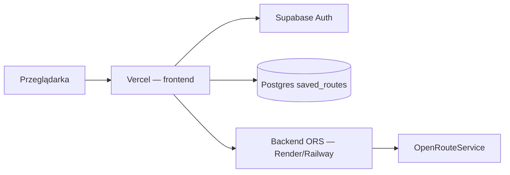

# Supabase + Vercel — stan obecny

Auth i zapisane trasy działają przez **Supabase**. Backend Express to wyłącznie proxy OpenRouteService (geocode / route / loop).

**Ważne:** `ORS_API_KEY` tylko na backendzie — nigdy w Vercel / frontendzie.

---

## Supabase (jednorazowo)

1. [supabase.com](https://supabase.com) → **New project** (zapisz hasło bazy).
2. **SQL Editor** → wklej [`supabase/schema.sql`](../supabase/schema.sql) → **Run**.
3. (Zalecane pod profil / preferencje) uruchom też [`profiles.optional.sql`](../supabase/profiles.optional.sql).
4. **Authentication → Providers** → włącz **Email**.
5. Na czas developmentu możesz wyłączyć „Confirm email”.
6. Klucze: przycisk **Connect** u góry projektu albo **Settings → API Keys**:
   - Project URL → `VITE_SUPABASE_URL` (bez `/rest/v1/`)
   - Publishable / anon key → `VITE_SUPABASE_ANON_KEY`

**Po aktualizacji schematu na istniejącym projekcie** uruchom ponownie `schema.sql` (dodaje `is_public`, politykę UPDATE i SELECT dla tras publicznych).

---

## Frontend na Vercel

1. Repo na GitHubie.
2. [vercel.com](https://vercel.com) → **Add New Project**.
3. **Root Directory:** `cycle-route-mvp/frontend`
4. Framework: Vite (automatycznie).
5. Environment Variables:

   | Nazwa | Wartość |
   |-------|---------|
   | `VITE_SUPABASE_URL` | URL projektu Supabase |
   | `VITE_SUPABASE_ANON_KEY` | publishable / anon key |
   | `VITE_API_URL` | publiczny URL backendu ORS |

6. Deploy → URL typu `https://twoja-app.vercel.app`.

Szczegóły backendu: [`DEPLOY_BACKEND.md`](./DEPLOY_BACKEND.md).

---

## Checklist produkcji

- [ ] RLS włączone na `saved_routes` (z `schema.sql`)
- [ ] `ORS_API_KEY` tylko na backendzie
- [ ] `ALLOWED_ORIGINS` zawiera domenę Vercel (backend i tak akceptuje `*.vercel.app`)
- [ ] `VITE_API_URL` wskazuje na wdrożony backend
- [ ] Confirm email / reset hasła skonfigurowane w Supabase według potrzeb
