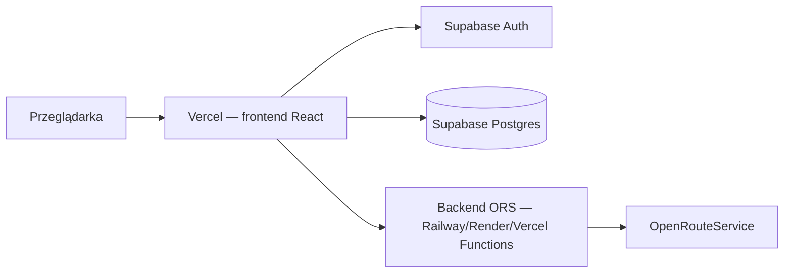

# Cycle Your Way — migracja na Supabase + Vercel

## Dlaczego teraz zapis tras „nie działa”

Kod w repozytorium jest poprawny, ale **na porcie 5000 często działa stary proces Node** (sprzed naprawy SQLite). Objawy:

- rejestracja zwraca użytkownika **bez `id`**
- token JWT **bez pola `sub`**
- zapis trasy kończy się błędem `Provided value cannot be bound to SQLite parameter 1`

**Szybka naprawa lokalnie (zanim przejdziesz na Supabase):**

```powershell
# 1. Znajdź proces na porcie 5000
netstat -ano | findstr ":5000"

# 2. Zabij PID z kolumny LISTENING (np. 8916)
taskkill /PID 8916 /F

# 3. Uruchom backend od nowa
cd cycle-route-mvp/backend
npm run dev
```

Potem: **wyloguj się → zarejestruj się ponownie** (stary token jest nieważny).

Test w PowerShell (powinno zwrócić `id` w `user`):

```powershell
Invoke-RestMethod -Uri "http://localhost:5000/api/auth/register" -Method POST -ContentType "application/json" -Body '{"email":"test@example.com","password":"secret12"}' | ConvertTo-Json
```

---

## Docelowa architektura



| Warstwa | Technologia | Odpowiedzialność |
|--------|-------------|------------------|
| Frontend | Vercel (Vite/React) | UI, mapa, wykresy |
| Konta + trasy | Supabase Auth + Postgres | logowanie, rejestracja, zapisane trasy (RLS) |
| Trasy rowerowe | Node API (osobny hosting) | geocode, route, loop — **klucz ORS musi zostać na serwerze** |

**Ważne:** klucza `ORS_API_KEY` **nie wkładaj** do frontendu na Vercel. Zostaje po stronie serwera.

---

## Etap 1 — Supabase (≈ 30–60 min)

### 1.1 Nowy projekt

1. Wejdź na [https://supabase.com](https://supabase.com) → **New project**.
2. Zapisz hasło do bazy (Database password).
3. Poczekaj aż projekt się utworzy.

### 1.2 Tabela tras

1. **SQL Editor** → wklej plik `supabase/schema.sql` z tego repo → **Run**.
2. Sprawdź w **Table Editor**, że jest tabela `saved_routes`.

### 1.3 Auth

1. **Authentication** → **Providers** → włącz **Email**.
2. (Opcjonalnie) wyłącz „Confirm email” na czas developmentu.

### 1.4 Klucze API

**Project Settings → API:**

- `Project URL` → np. `https://xxxx.supabase.co`
- `anon public` key → do frontendu (bezpieczny z RLS)
- **service_role** → tylko backend, **nigdy** w frontendzie

---

## Etap 2 — Frontend + Supabase (≈ 2–4 h)

### 2.1 Zależność

```powershell
cd cycle-route-mvp/frontend
npm install @supabase/supabase-js
```

### 2.2 Zmienne środowiskowe

Utwórz `frontend/.env.local`:

```env
VITE_SUPABASE_URL=https://TWOJ-PROJEKT.supabase.co
VITE_SUPABASE_ANON_KEY=twoj-anon-key
VITE_API_URL=http://localhost:5000
```

### 2.3 Co zamienić w kodzie

| Teraz (MVP) | Po migracji |
|-------------|-------------|
| `AuthContext` + `/api/auth/*` | `@supabase/supabase-js` → `signUp`, `signInWithPassword`, `signOut`, `getSession` |
| `SavedRoutes` + `/api/saved-routes` | `supabase.from('saved_routes').select/insert/delete` |
| `localStorage` token JWT | sesja Supabase (automatyczna) |
| `backend/db.js` + SQLite | **usunąć** (auth + trasy w Supabase) |

Przykład zapisu trasy:

```javascript
const { data, error } = await supabase.from('saved_routes').insert({
  user_id: session.user.id,
  name: 'Moja trasa',
  mode: 'Loop',
  geojson: routeGeoJson,
  distance_km: 42.5,
  duration_seconds: 7200,
})
```

RLS w Postgresie samo pilnuje, że użytkownik widzi tylko swoje trasy — **nie potrzebujesz własnego JWT**.

### 2.4 Backend zostaje (na razie) tylko do ORS

Z `server.js` możesz usunąć:

- `routes/auth.js`
- `routes/savedRoutes.js`
- `db.js`

Zostaw:

- `GET /api/geocode`
- `POST /api/route`
- `POST /api/loop`

---

## Etap 3 — Vercel (frontend) (≈ 30 min)

1. Wypchnij repo na GitHub.
2. [vercel.com](https://vercel.com) → **Add New Project** → wybierz repo.
3. **Root Directory:** `cycle-route-mvp/frontend`
4. **Framework Preset:** Vite
5. **Environment Variables:**

   | Nazwa | Wartość |
   |-------|---------|
   | `VITE_SUPABASE_URL` | URL z Supabase |
   | `VITE_SUPABASE_ANON_KEY` | anon key |
   | `VITE_API_URL` | URL backendu ORS (Etap 4) |

6. Deploy → dostaniesz link typu `https://cycle-your-way.vercel.app`.

---

## Etap 4 — Backend ORS w produkcji (≈ 1 h)

Express z `server.js` **nie musi** iść na Vercel (można, ale wygodniej osobno).

**Rekomendacja na start:** [Railway](https://railway.app) lub [Render](https://render.com)

1. Nowy serwis → repo → folder `cycle-route-mvp/backend`.
2. Start command: `npm start`
3. Env:

   ```env
   ORS_API_KEY=...
   PORT=5000
   ```

4. Skopiuj publiczny URL (np. `https://cycleyourway-api.onrender.com`).
5. W Vercel ustaw `VITE_API_URL` na ten URL.
6. W backendzie dodaj CORS dla domeny Vercel:

   ```javascript
   app.use(cors({ origin: ['https://twoja-app.vercel.app', 'http://localhost:5173'] }))
   ```

**Alternatywa:** przenieść endpointy ORS do **Vercel Serverless Functions** (`api/route.js` itd.) — więcej refaktoru, jeden hosting.

---

## Kolejność prac (rekomendowana)

1. **Supabase** — projekt + `schema.sql` + test ręczny w Table Editor.
2. **Frontend lokalnie** — podmiana auth i zapisanych tras na Supabase (backend ORS nadal lokalny).
3. **Deploy backendu ORS** — Railway/Render.
4. **Deploy frontendu** — Vercel.
5. **Usuń** stary kod SQLite/JWT z backendu.

---

## Checklist przed produkcją

- [ ] RLS włączone na `saved_routes` (z `schema.sql`)
- [ ] `service_role` key tylko na serwerze (jeśli w ogóle używany)
- [ ] `ORS_API_KEY` tylko na backendzie
- [ ] CORS ograniczony do Twojej domeny Vercel
- [ ] W Supabase: polityka haseł / confirm email według potrzeb

---

## Co mogę zrobić w następnym kroku

Jeśli chcesz, w kolejnej sesji mogę **wdrożyć Etap 2 w kodzie** (Supabase client + nowy `AuthContext` + `SavedRoutes` bez własnego backendu auth). Ty tylko założysz projekt Supabase i wkleisz klucze do `.env.local`.
